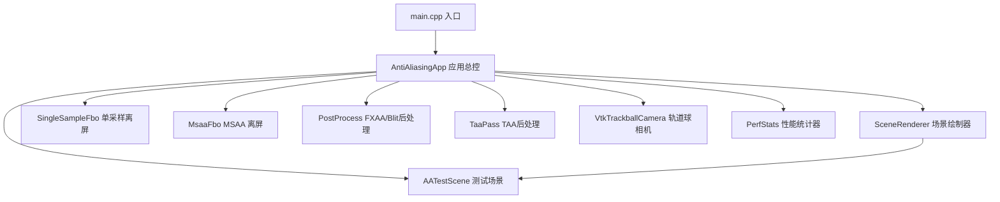

# OpenGL 抗锯齿对比框架 (OpenGL_Anti_Aliasing) 完整技术大纲与全景 README

> 源码地址：[GitHub 仓库](https://github.com/HalCG/OpenGLInstance/tree/main/OpenGL_Anti_Aliasing)  
> 本文档为 `OpenGL_Anti_Aliasing` 子项目的**完整技术大纲与工程指南**，全量整合了总体架构设计、四种 AA 算法数学与 Shader 实现、代码导读地图、核心问答集锦 (Q1~Q11)、RenderDoc 典型排查实录以及附录对比表。

---

## 目录

1. [项目动机与设计原则](#1-项目动机与设计原则)
2. [总体架构与模块关系](#2-总体架构与模块关系)
3. [目录结构与各文件职责](#3-目录结构与各文件职责)
4. [程序生命周期与主循环时序](#4-程序生命周期与主循环时序)
   - 4.1 启动初始化链 (`init`)
   - 4.2 主循环策略 (`run`：事件驱动与省电)
   - 4.3 单帧执行 12 步详解 (`renderFrame`)
5. [核心状态变量地图](#5-核心状态变量地图)
6. [测试场景设计 (AATestScene)](#6-测试场景设计-aatestscene)
7. [离屏 FBO 架构与深度格式](#7-离屏-fbo-架构与深度格式)
8. [四种抗锯齿 (AA) 模式与 Shader 深入剖析](#8-四种抗锯齿-aa-模式与-shader-深入剖析)
   - 8.1 [None (无 AA 基线)](#81-none-无-aa-基线)
   - 8.2 [MSAA (硬件多重采样与 Resolve 机制)](#82-msaa-硬件多重采样与-resolve-机制)
   - 8.3 [FXAA (后处理感知亮度与 `fxaa.frag` 边缘切线探测)](#83-fxaa-后处理感知亮度与-fxaafrag-边缘切线探测)
   - 8.4 [TAA (时间复用、Halton 抖动、`taa.frag` 3x3 AABB Clamping 与重投影)](#84-taa-时间复用halton-抖动taafrag-3x3-aabb-clamping-与重投影)
9. [性能统计与 GpuTimer (`PerfStats`)](#9-性能统计与-gputimer-perfstats)
10. [源码推荐阅读路线](#10-源码推荐阅读路线)
11. [技术深度问答集锦 (Q1 ~ Q11)](#11-技术深度问答集锦-q1--q11)
12. [RenderDoc 典型踩坑与排查实录](#12-renderdoc-典型踩坑与排查实录)
13. [附录：多维对比表、观察指南、工程坑点与构建运行](#13-附录多维对比表观察指南工程坑点与构建运行)

---

## 1. 项目动机与设计原则

### 1.1 要解决的问题
在实时 3D 渲染中，几何体边缘、细小网格和高频纹理会在屏幕像素网格上产生严重的 **锯齿（Aliasing）** 与 **走样闪烁**。工业界提出了多种不同维度的抗锯齿方案，各自在计算开销、显存占用和画面质量上作出了权衡。

本 Demo 的目标是在 **同一场景、同一套前向渲染 Pass** 下，支持运行时通过按键实时切换四种典型抗锯齿方案，进行直观的画面品质与性能对比：

| 模式 | 按键 | 方案类型 | 核心思想 |
| :--- | :--- | :--- | :--- |
| **None** | `1` / `F1` | 无 AA (基线) | 场景渲染到单采样离屏 FBO 后直接 blit 输出到屏幕 |
| **MSAA** | `2` / `F2` | 硬件几何 AA | 硬件多重采样 FBO 渲染，离屏 resolve 合成出屏 |
| **FXAA** | `3` / `F3` | 屏幕后处理 AA | 依赖感知亮度 (Luma) 检测图像强对比边缘并沿切线模糊 |
| **TAA** | `4` / `F4` | 时间复用 AA | 相机子像素抖动 (Halton Jitter) + 历史帧重投影与 AABB Color Clamping 混合 |

### 1.2 三条核心设计原则

1. **Scene Pass 统一**：
   四种模式共用相同的场景模型（`AATestScene`）与绘制逻辑（`SceneRenderer`），确保对比的是**抗锯齿手段本身的优劣**，而非不同的渲染路径。
2. **独立离屏 FBO 管理**：
   默认窗口 FBO 禁用 GLFW MSAA 采样点（`GLFW_SAMPLES = 0`）。所有渲染均在独立的离屏 FBO（`SingleSampleFbo` 或 `MsaaFbo`）中完成，以便精准保留 `Color` 和 `Depth` 纹理供 TAA/FXAA 使用。
3. **公平对比与可观测性**：
   - 标题栏与控制台输出 `scene_ms` / `post_ms`，分离几何与后处理开销；
   - 测试场景专门包含：硬纹理、细线、细四边形、多实例模型。

---

## 2. 总体架构与模块关系

### 2.1 模块依赖关系



### 2.2 一帧数据流水线

```mermaid
flowchart LR
    subgraph input [1. 准备阶段]
        J[TAA: Halton 序列抖动]
        BC[buildCamera 组装 VP]
    end

    subgraph scene [2. Scene Pass (GpuTimer)]
        FBO{currentMode_?}
        FBO -->|MSAA| MSAA[msaaFbo_.bind]
        FBO -->|None/FXAA/TAA| Single[singleFbo_.bind]
        MSAA --> Draw[sceneRenderer_.render]
        Single --> Draw
    end

    subgraph post [3. Post Pass (GpuTimer)]
        SW{currentMode_?}
        SW -->|None| Blit[blitColorToDefault]
        SW -->|MSAA| Resolve[resolveColorToDefault]
        SW -->|FXAA| Fxaa[applyFxaa]
        SW -->|TAA| TaaApply[taaPass_.apply] --> BlitTex[blitTexture]
    end

    J --> BC --> scene --> post
    post --> Save[保存 prevViewProj_ 供下一帧重投影]
```

---

## 3. 目录结构与各文件职责

```
OpenGL_Anti_Aliasing/
├── CMakeLists.txt              # CMake 构建配置文件
├── main.cpp                    # 程序入口：init → run → shutdown
├── include/
│   ├── AntiAliasingApp.hpp     # 应用总控制类：管理状态、渲染主循环、GLFW输入回调
│   ├── AppConfig.hpp           # 窗口/相机/MSAA 常量配置与资源路径解析
│   ├── RenderTypes.hpp         # AAMode 枚举、FrameCamera、FrameStats 结构体声明
│   ├── VtkTrackballCamera.hpp  # VTK 风格轨道球相机（yaw/pitch/radius 交互）
│   ├── AATestScene.hpp         # 测试场景声明（包含球体、细线网格、高频纹理墙）
│   ├── SceneRenderer.hpp       # Scene Pass 绘制器（物体 Shader 与线框 Shader 管理）
│   ├── Framebuffer.hpp         # SingleSampleFbo / MsaaFbo 离屏帧缓冲抽象
│   ├── PostProcess.hpp         # 后处理管理类：全屏 Quad 绘制、Blit 与 FXAA 触发
│   ├── TaaPass.hpp             # TAA Pass 管理类：历史帧 Ping-Pong 缓冲管理与着色器调用
│   └── PerfStats.hpp           # 性能统计器：GPU Query 计时 + CPU 帧时间平滑计算
├── src/                        # 对应头文件的 C++ 实现代码
└── resources/
    ├── shaders/                # 着色器资源文件
    │   ├── scene.vert / scene.frag    # 场景物体渲染 Shader
    │   ├── line.vert / line.frag      # 调试细线 Shader
    │   ├── fxaa.frag                  # FXAA 屏幕后处理边缘检测与混合 Shader
    │   ├── taa.frag                   # TAA 重投影、AABB Clamping 与历史混合 Shader
    │   ├── blit.vert / blit.frag      # 纹理直出全屏 Quad Shader
    │   └── fullscreen.vert            # 全屏三角形通用顶点 Shader
    └── models/spot/            # 几何模型与材质纹理资源 (spot.obj + spot.png)
```

---

## 4. 程序生命周期与主循环时序

### 4.1 启动初始化链 (`init`)
```
main()
  └─ AntiAliasingApp::init()
       ├─ initWindow()          GLFW 窗口创建、GLAD 加载、注册 Key/Mouse 回调
       ├─ scene_.init()         加载 Spot 模型、生成地面、构造网格线框与高频属性
       ├─ sceneRenderer_.init() 编译 scene.vert/frag 与 line.vert/frag
       ├─ postProcess_.init()   初始化全屏 Quad VAO 与 fxaa.frag/blit.frag
       ├─ taaPass_.init()       初始化 taa.frag 与双历史帧 Texture
       ├─ perf_.init()          初始化 GPU Timer Query 对象
       └─ resizeTargets()      根据窗口实际像素宽高分配 FBO 与 TAA 历史纹理
```

### 4.2 主循环策略 (`run`：事件驱动与省电)
常规渲染器每帧都在死循环重绘，这会白白消耗 CPU/GPU。本项目引入了**动态事件驱动策略**：
```cpp
void AntiAliasingApp::run() {
    while (!glfwWindowShouldClose(window_)) {
        // TAA 模式需要每帧进行 Halton 采样点抖动与历史帧混合，必须持续出帧
        const bool continuousRender = (currentMode_ == AAMode::TAA);
        const bool active = cameraDirty_ || continuousRender || camera_.isDragging();

        if (active) {
            glfwPollEvents();   // 有交互或 TAA 模式：非阻塞轮询输入
        } else {
            glfwWaitEvents();   // 画面静态无操作：阻塞等待操作系统事件 (零 GPU 占用省电)
        }

        if (cameraDirty_ || continuousRender) {
            renderFrame();
            glfwSwapBuffers(window_);
            if (!continuousRender) cameraDirty_ = false;
        }
    }
}
```

### 4.3 单帧执行 12 步详解 (`renderFrame`)

| 步骤 | 代码位置 | 核心动作 |
|------|----------|--------|
| **1** | `perf_.beginFrame()` | 记录 CPU 起始时间戳 |
| **2** | TAA 时 `nextJitter` | 使用 Halton 序列生成像素子像素偏移 |
| **3** | `buildCamera(jitter)` | 组装 view / projection / VP / invVP 矩阵 |
| **4** | `scenePass.begin()` | 开启 Scene Pass GPU Timer Query 计时 |
| **5** | 绑定 FBO + clear + `sceneRenderer_.render` | 场景 3D 几何与线框绘制到离屏目标 |
| **6** | `scenePass.endMs()` | 停止 Scene Pass 计时并回读 `scenePassMs` |
| **7** | `postPass.begin()` | 开启 Post Pass GPU 计时 |
| **8** | `switch(currentMode_)` | 分支执行 None / MSAA / FXAA / TAA 出屏后处理 |
| **9** | `postPass.endMs()` | 停止 Post Pass 计时并回读 `postPassMs` |
| **10** | 保存 `prevViewProj_` | 保存本帧 VP 矩阵，供下一帧 TAA 重投影使用 |
| **11** | `perf_.endFrame()` | 计算 CPU 帧时间与滑动平均平滑 FPS |
| **12** | 更新窗口标题 | 每 15 帧更新一次窗口标题栏性能指标（拖拽时跳过） |

---

## 5. 核心状态变量地图

`AntiAliasingApp` 中的成员变量决定了「何时画、画什么、怎么画」：

| 变量 | 类型 | 核心作用 |
|------|------|------|
| `currentMode_` | `AAMode` | **主开关**：决定 Scene Pass 使用哪种 FBO，以及 Post Pass 走哪条分支 |
| `msaaPresetIndex_` | `int` | MSAA 采样点倍率（`2x` / `4x`，快捷键 `[` `]` 切换） |
| `camera_` | `VtkTrackballCamera` | 轨道球相机参数（yaw / pitch / radius / target） |
| `cameraDirty_` | `bool` | 脏标记：相机视角、窗口尺寸或模式改变时置 `true` 触发重绘 |
| `prevViewProj_` | `glm::mat4` | 上一帧未抖动的 View-Projection 矩阵（TAA 重投影核心） |
| `hasPrevViewProj_` | `bool` | 上一帧 VP 矩阵是否有效 |
| `singleFbo_` | `SingleSampleFbo` | 单采样离屏 FBO（None / FXAA / TAA 使用） |
| `msaaFbo_` | `MsaaFbo` | 多重采样离屏 FBO（MSAA 模式使用） |
| `postProcess_` | `PostProcess` | 管理 Blit、FXAA 全屏 Pass |
| `taaPass_` | `TaaPass` | 管理 TAA 全屏 Pass、Halton 抖动与双历史纹理 Ping-Pong |
| `perf_` | `PerfStats` | 管理 GPU Timer Query 计时与 CPU 帧率统计 |

---

## 6. 测试场景设计 (AATestScene)

为了科学直观地评估各种 AA 方案的优缺点，测试场景专门搭建了四类极具代表性的几何与纹理元素：

1. **Spot 兽首模型**：复杂曲面与高精几何边缘，测试几何体轮廓锯齿。
2. **地板棋盘格 (Checkerboard Ground)**：Procedural 高频棋盘格纹理，延伸至远方。用于测试极远处的**纹理走样 (Shader Aliasing)** 和摩尔纹。
3. **细线网格 (Line Grid)**：`GL_LINES` 绘制的网格线。用于测试细微结构的断裂与闪烁。
4. **细四边形条 (Thin Quads)**：极窄的面片，用于测试亚像素级结构的走样。

---

## 7. 离屏 FBO 架构与深度格式

离屏 FBO 的设计是抗锯齿对比框架的物理基础：

### 7.1 `SingleSampleFbo` (单采样离屏 FBO)
- **Color Attachment**：`GL_RGBA8` 格式普通 2D 纹理；
- **Depth Attachment**：`GL_DEPTH24_STENCIL8` 或 `GL_DEPTH_COMPONENT32F` 浮点深度纹理。
- **作用**：为 None、FXAA、TAA 提供标准单采样场景颜色图与高精度深度图（TAA 重投影必须利用深度图解算世界坐标）。

### 7.2 `MsaaFbo` (多重采样离屏 FBO)
- **Color Attachment**：`GL_TEXTURE_2D_MULTISAMPLE`（4x / 2x MSAA）；
- **Depth Attachment**：`GL_TEXTURE_2D_MULTISAMPLE` 深度格式。
- **底层创建 API**：
  ```cpp
  glTexImage2DMultisample(GL_TEXTURE_2D_MULTISAMPLE, samples, GL_RGBA8, width, height, GL_TRUE);
  ```
- **Resolve 方法 (`resolveColorToDefault`)**：
  调用 `glBlitFramebuffer` 触发 GPU 硬件 Resolve 逻辑，将多采样离屏 Buffer 压缩平滑拷贝输出给窗口默认帧缓冲。

---

## 8. 四种抗锯齿 (AA) 模式与 Shader 深入剖析

### 8.1 None (无 AA 基线)
- **原理**：几何体光栅化时仅对像素中心点做一次采样。
- **管线流程**：场景画入 `singleFbo_` $\rightarrow$ 调用 `glBlitFramebuffer` 原样复制到屏幕。

### 8.2 MSAA (硬件多重采样抗锯齿)
- **原理**：在几何光栅化阶段，GPU 对每个像素划分 $N$ 个子采样点（如 4x MSAA），每个子采样点独立计算覆盖率与深度，但 Fragment Shader 仅在三角形覆盖处运行一次。
- **Resolve 硬件机制**：
  ```cpp
  void MsaaFbo::resolveColorToDefault(int width, int height) {
      glBindFramebuffer(GL_READ_FRAMEBUFFER, fbo_);
      glBindFramebuffer(GL_DRAW_FRAMEBUFFER, 0);
      glBlitFramebuffer(0, 0, width_, height_, 0, 0, width, height, GL_COLOR_BUFFER_BIT, GL_NEAREST);
  }
  ```
- **局限**：无法解决 Alpha Test 贴图内部锯齿与 Procedural 高频纹理走样。

### 8.3 FXAA (快速近似抗锯齿与 `fxaa.frag`)
- **原理**：基于图像后处理，利用心理学感知亮度检测强对比度边缘并沿着切线方向双向模糊。
- **亮度公式**：$L = 0.299R + 0.587G + 0.114B$（绿色权重最高，符合人眼感知）。
- **`resources/shaders/fxaa.frag` 完整代码实现**：

```glsl
#version 430 core
layout (location = 0) out vec4 FragColor;

in vec2 vTexCoord;

uniform sampler2D uInput;
uniform vec2 uTexelSize;

// 心理学感知亮度公式 (Luma / Luminance)
float luma(vec3 c) {
    return dot(c, vec3(0.299, 0.587, 0.114));
}

void main() {
    // 采样中心 M 及东西南北 4 个邻域像素
    vec3 rgbM = texture(uInput, vTexCoord).rgb;
    vec3 rgbN = texture(uInput, vTexCoord + vec2(0.0, uTexelSize.y)).rgb;
    vec3 rgbS = texture(uInput, vTexCoord - vec2(0.0, uTexelSize.y)).rgb;
    vec3 rgbE = texture(uInput, vTexCoord + vec2(uTexelSize.x, 0.0)).rgb;
    vec3 rgbW = texture(uInput, vTexCoord - vec2(uTexelSize.x, 0.0)).rgb;

    float lumaM = luma(rgbM);
    float lumaN = luma(rgbN);
    float lumaS = luma(rgbS);
    float lumaE = luma(rgbE);
    float lumaW = luma(rgbW);
    float lumaMin = min(lumaM, min(min(lumaN, lumaS), min(lumaE, lumaW)));
    float lumaMax = max(lumaM, max(max(lumaN, lumaS), max(lumaE, lumaW)));

    // 比较垂直与水平梯度
    float edgeVert = abs((lumaN + lumaS) - 2.0 * lumaM);
    float edgeHorz = abs((lumaE + lumaW) - 2.0 * lumaM);
    bool horz = edgeHorz >= edgeVert;

    // 沿边缘切线方向采样两点并混合
    vec2 offset = horz ? vec2(uTexelSize.x, 0.0) : vec2(0.0, uTexelSize.y);
    vec3 rgbA = texture(uInput, vTexCoord - offset).rgb;
    vec3 rgbB = texture(uInput, vTexCoord + offset).rgb;
    vec3 result = mix(rgbA, rgbB, 0.5);

    // Luma Clamping 校验：防止过度模糊
    float lumaResult = luma(result);
    result = clamp(result, min(rgbM, result), max(rgbM, result));
    if (lumaResult < lumaMin || lumaResult > lumaMax) {
        result = rgbM;
    }

    FragColor = vec4(result, 1.0);
}
```

### 8.4 TAA (时间抗锯齿与 `taa.frag`)
- **原理**：低差异序列 Halton(2, 3) 抖动投影矩阵 + 深度反推世界坐标重投影 + 3x3 邻域 AABB Color Clamping 消除鬼影。
- **Halton(2, 3) 抖动计算公式**：
  $$\text{jitterX} = \frac{2.0 \cdot \text{HaltonX} - 1.0}{\text{width}}, \quad \text{jitterY} = \frac{2.0 \cdot \text{HaltonY} - 1.0}{\text{height}}$$
- **`resources/shaders/taa.frag` 完整代码实现**：

```glsl
#version 430 core
layout (location = 0) out vec4 FragColor;

in vec2 vTexCoord;

uniform sampler2D uCurrentColor;
uniform sampler2D uCurrentDepth;
uniform sampler2D uHistoryColor;

uniform mat4 uInvViewProj;
uniform mat4 uPrevViewProj;
uniform vec2 uTexelSize;
uniform float uBlendFactor;
uniform bool uHasHistory;

// 【历史帧重投影 (Reprojection)】
vec3 reprojectHistory(vec2 uv, out bool valid) {
    float depth = texture(uCurrentDepth, uv).r;
    vec4 ndc = vec4(uv * 2.0 - 1.0, depth * 2.0 - 1.0, 1.0);
    vec4 world = uInvViewProj * ndc;
    world /= world.w;
    vec4 prevNdc = uPrevViewProj * world;
    prevNdc /= prevNdc.w;
    vec2 prevUv = prevNdc.xy * 0.5 + 0.5;
    valid = prevUv.x >= 0.0 && prevUv.x <= 1.0 && prevUv.y >= 0.0 && prevUv.y <= 1.0;
    return texture(uHistoryColor, prevUv).rgb;
}

// 【邻域 AABB 颜色裁剪 (Neighborhood Color Clamping)】消除鬼影的核心！
vec3 clipHistory(vec3 history, vec3 current) {
    vec3 minC = current;
    vec3 maxC = current;
    for (int x = -1; x <= 1; ++x) {
        for (int y = -1; y <= 1; ++y) {
            vec2 uv = vTexCoord + vec2(float(x), float(y)) * uTexelSize;
            vec3 c = texture(uCurrentColor, uv).rgb;
            minC = min(minC, c);
            maxC = max(maxC, c);
        }
    }
    return clamp(history, minC, maxC);
}

void main() {
    vec3 current = texture(uCurrentColor, vTexCoord).rgb;
    if (!uHasHistory) {
        FragColor = vec4(current, 1.0);
        return;
    }

    bool valid;
    vec3 history = reprojectHistory(vTexCoord, valid);
    if (!valid) {
        FragColor = vec4(current, 1.0);
        return;
    }

    // 执行 3x3 AABB 颜色裁剪防鬼影
    history = clipHistory(history, current);

    // 时间维度指数平滑混合 (默认 uBlendFactor = 0.1)
    vec3 result = mix(history, current, uBlendFactor);
    FragColor = vec4(result, 1.0);
}
```

---

## 9. 性能统计与 GpuTimer (`PerfStats`)

为了毫秒级精确分离 Scene Pass 与 Post Pass 的显存开销，项目使用 OpenGL `GL_TIME_ELAPSED` 双缓冲区 Query 对象：

```cpp
void GpuTimer::begin() {
    glBeginQuery(GL_TIME_ELAPSED, queries_[queryIndex_]);
}

void GpuTimer::endMs() {
    glEndQuery(GL_TIME_ELAPSED);
    GLuint64 timeElapsed = 0;
    glGetQueryObjectui64v(queries_[1 - queryIndex_], GL_QUERY_RESULT, &timeElapsed);
    lastMs_ = static_cast<float>(timeElapsed) / 1000000.0f;
    queryIndex_ = 1 - queryIndex_; // 异步双缓冲避开 CPU 阻塞
}
```

---

## 10. 源码推荐阅读路线

建议顺着以下文件链路通读工程源码：

```
① main.cpp                      # 了解 3 步生命周期 (init -> run -> shutdown)
 └─► ② RenderTypes.hpp          # 了解 AAMode 枚举与 FrameCamera 数据结构
      └─► ③ AntiAliasingApp.hpp # 查阅核心成员变量地图
           └─► ④ AntiAliasingApp.cpp (run)          # 观察事件驱动与省电主循环
                └─► ⑤ AntiAliasingApp.cpp (renderFrame) # 【核心心脏】 Scene/Post 分支
                     ├─► ⑥ Framebuffer.cpp          # 观察单采样与 MSAA FBO 的创建与 Blit/Resolve 区别
                     ├─► ⑦ PostProcess.cpp & fxaa.frag  # 观察 FXAA 屏幕后处理边缘检测算法
                     └─► ⑧ TaaPass.cpp & taa.frag       # 观察 Halton 抖动、重投影与 AABB Color Clamping 逻辑
```

---

## 11. 技术深度问答集锦 (Q1 ~ Q11)

### Q1. MSAA 硬件 Resolve 与普通单采样 FBO 的 Blit 调用的联系与区别是什么？
C++ 代码中，`SingleSampleFbo::blitColorToDefault` 和 `MsaaFbo::resolveColorToDefault` 调用的 OpenGL API 格式一致：
```cpp
glBlitFramebuffer(0, 0, width_, height_, 0, 0, width, height, GL_COLOR_BUFFER_BIT, GL_NEAREST);
```
* **单采样 FBO**：源 FBO 挂载的是 `GL_TEXTURE_2D` 纹理，`glBlitFramebuffer` 仅执行标准的像素点对点复制（BitBlt Copy），不做抗锯齿计算。
* **MSAA FBO**：源 FBO 挂载的是 `GL_TEXTURE_2D_MULTISAMPLE` 纹理。当调用 `glBlitFramebuffer` 时，GPU 硬件层会自动激活 **Resolve 逻辑单元**，对像素内部的多个 Subsample 点取加权平均，将多采样压缩合成为平滑的单采样画面。

### Q2. TAA 为什么会出现拖尾鬼影 (Ghosting)？AABB Color Clamping 是如何解决的？
* **鬼影成因**：当相机快速移动或发生遮挡解遮挡（Disocclusion）时，当前像素在上一帧对应位置采到的历史颜色来自于“旧背景”或“旧物体”。如果直接混合，就会在运动轨迹后拖出严重的脏色阴影。
* **AABB Color Clamping 解法**：在 `taa.frag` 中，采样当前像素周围 $3 \times 3$ 邻域的颜色，计算出色彩空间中的 AABB 包围盒 $[C_{\min}, C_{\max}]$。如果重投影拿到的历史颜色落在包围盒之外（说明发生遮挡突变），强行将历史颜色 Clamp 截断回包围盒边缘，瞬间抹除不合理的旧历史数据！

### Q3. FXAA 为什么不需要深度缓冲 (Depth Buffer) 就能运行？
FXAA 是一种纯粹的**屏幕空间图像后处理抗锯齿**：
1. 仅依赖当前输入的 2D RGBA 颜色图像；
2. 利用感知亮度公式 $L = 0.299R + 0.587G + 0.114B$ 计算每个像素的 Luma；
3. 对比中心像素与四周 4 邻域的亮度梯度检测强对比度边缘，并探查边缘切线方向；
4. 沿切线方向双向偏移采样并混合，实现快速近似抗锯齿。

### Q4. TAA 模式下 Projection 矩阵植入 Jitter 的原理是什么？
Halton 序列生成 normalized 偏移值 `(haltonX, haltonY)` $\in [0, 1]$。  
投影矩阵的 `proj[2][0]` 和 `proj[2][1]` 控制 NDC 坐标偏移：
```cpp
const float jitterX = (2.0f * haltonX - 1.0f) / width;
const float jitterY = (2.0f * haltonY - 1.0f) / height;
proj[2][0] += jitterX;
proj[2][1] += jitterY;
```
这样使得渲染几何体在子像素级别产生极小偏移，连续多帧累积即可实现媲美 16x MSAA 的超采样效果。

### Q5. 为什么做 TAA 重投影时 Depth 需要 `depth * 2.0 - 1.0`？
OpenGL 的 Depth 纹理存储范围是 $[0.0, 1.0]$。而在 NDC 坐标系中，$z$ 的取值范围是 $[-1.0, 1.0]$。  
因此在解算 NDC 坐标拼装 `vec4 ndc = vec4(uv * 2.0 - 1.0, depth * 2.0 - 1.0, 1.0)` 时，必须乘 2 减 1 将 Depth 映射回 $[-1.0, 1.0]$，才能乘以 `uInvViewProj` 准确逆推世界空间坐标！

### Q6. `hasHistory`（App 侧）与 `validHistory_`（TaaPass 侧）有何区别？
- `hasHistory`（`hasPrevViewProj_`）：App 层标志，首帧、窗口 resize 或刚切回 TAA 模式时为 `false`，表示没有有效的上一帧 VP 矩阵；
- `validHistory_`：TaaPass 层标志，表示历史纹理内部是否已有有效绘制内容。  
只有两者同时为 `true` 时，`uHasHistory` 才为 `true`，防止首帧采样空纹理造成画面黑屏。

### Q7. 为什么有 `reprojectHistory` 重投影后还需要 `clipHistory`？
重投影计算的历史位置容易受遮挡改变、视角旋转拉伸与深度精度限制的影响。直接 `mix` 会导致历史废弃颜色污染当前画面产生鬼影。`clipHistory` 将历史颜色裁剪在当帧 $3 \times 3$ 包围盒内，是混合前的**绝对安全约束过滤器**。

### Q8. 主循环为何 `pollEvents` 放在 `renderFrame` 之前？
- **减少输入延迟**：先 poll 鼠标键盘事件，更新后的视角参数能**立即应用在当帧**的 `buildCamera` 中，画面响应毫无延迟；
- **拖拽保护**：即使不是 TAA 模式，拖拽视图过程中依然保持 `pollEvents`，防止由于 `cameraDirty_` 重置导致丢失鼠标位移事件。

### Q9. 离屏 FBO 为什么需要独立的 `resizeTargets`？
当用户拖拽调整 GLFW 窗口尺寸时，硬件显存纹理宽高必须重新分配。`resizeTargets` 会重新释放并重建 `SingleSampleFbo`、`MsaaFbo` 以及 TAA 的历史双缓冲纹理，同时重置 TAA 的历史标志 `resetHistory()`。

### Q10. TaaPass 的 `apply` 方法整体流程是怎样的？
1. 绑定当前 `history[writeIndex]` 纹理作为 FBO 输出目标；
2. 绑定 `uCurrentColor` (Slot 0)、`uCurrentDepth` (Slot 1)、`uHistoryColor` (Slot 2, 即 `history[readIndex]`)；
3. 传入 `uInvViewProj`、`uPrevViewProj`、`uBlendFactor` 等 Uniforms；
4. 绘制全屏 Quad，执行 `taa.frag` 重投影、Clamping 与混合；
5. 呈现结果到屏幕，并在帧末交换 `readIndex` 与 `writeIndex`。

### Q11. 工作目录或资源路径配置错误会发生什么？
程序将无法加载 `resources/shaders/...` 导致 Shader 编译报错崩塌，或无法加载 `resources/models/spot/` 导致几何为空。调试时需确保 Working Directory 设置在包含 `resources/` 文件夹的构建目录下。

---

## 12. RenderDoc 典型踩坑与排查实录

在开发和调试 `OpenGL_Anti_Aliasing` 框架期间，利用 RenderDoc 抓帧定位并解决了几类极其典型的渲染 Bug：

### 案例 1：MSAA 模式下画面边缘锯齿毫无改善 (AA-01)
- **现象**：按 `2` 切到 MSAA 模式后，几何体边缘锯齿毫无改善；渲染结果看起来和 None 模式无异。
- **RenderDoc 排查步骤**：
  1. Capture 抓取一帧，在 Event Browser 中选中 Scene Pass 的第一个 Mesh Draw Call；
  2. 打开 **Pipeline State -> Framebuffer** 选项卡，查看 Color Attachment 0 的属性：显示 **`Samples = 1`**（期望为 4）；
  3. 原因分析：`AntiAliasingApp.cpp` 149 行渲染分支中误将 `singleFbo_.bind()` 写在了 MSAA 分支里，导致 Scene Pass 全都在向单采样 FBO 绘制，MSAA 没有多采样数据可供 Resolve。
- **修复**：修正分支判定，确保 MSAA 模式下绑定 `msaaFbo_.bind()`。

### 案例 2：MSAA Resolve 导致画面花屏或局部缺失 (AA-02)
- **现象**：切换到 MSAA 模式后画面全黑、局部花屏或只显示窗口左下角一小块。
- **RenderDoc 排查步骤**：
  1. 在 Event Browser 中定位到 Post Pass 前的 `glBlitFramebuffer` 节点；
  2. 查看 **Inputs / Outputs**：发现 `READ_FRAMEBUFFER` 的矩形区域 `(0, 0, srcW, srcH)` 传入的是缩放前的逻辑尺寸，而非 High-DPI 真实 Framebuffer 像素尺寸；
  3. 导致 `glBlitFramebuffer` 仅对画面左下角进行了 Resolve 拷贝。
- **修复**：统一使用 `glfwGetFramebufferSize` 获取的真实像素宽高初始化与 Blit FBO 矩形。

### 案例 3：FXAA 模式下全屏出现深度伪彩与颜色混乱 (AA-03)
- **现象**：切换到 FXAA 模式后，画面全屏呈灰白色深度图伪彩或颜色混乱。
- **RenderDoc 排查步骤**：
  1. 选中 FXAA 全屏绘制 Pass 的 Draw Call；
  2. 检查 **Pipeline State -> Fragment Shader -> Texture Samplers**：绑定在 Slot 0 的纹理 ID 对应的是 `Depth32F` 深度纹理，而非 `RGBA8` Color 纹理；
  3. 原因分析：在调用 `postProcess_.applyFxaa(...)` 时参数传错，误将 `singleFbo_.depthTexture()` 当成颜色纹理传入，导致 FXAA 在深度图上计算 Luma 边缘。
- **修复**：纠正传参为 `singleFbo_.colorTexture()`。

### 案例 4：TAA 拖影异常与重影无法收敛 (AA-04)
- **现象**：TAA 模式下拖动相机时画面出现剧烈闪烁或长时间无法收敛的重影。
- **RenderDoc 排查步骤**：
  1. 使用 RenderDoc 的 **Capture Range (连续抓取 3 帧)** 功能；
  2. 对比第 1 帧与第 2 帧的 TAA Draw Call：查看 Samplers 绑定的 History 纹理；
  3. 发现第 2 帧 TAA 读入的 `historyTexture` 竟然和当前帧即将写入的 Render Target 是同一张纹理（Ping-Pong Swap 逻辑丢失），造成自己读写自己导致数据污染。
- **修复**：`TaaPass.cpp` 146 行修正读写索引：读 `history_[readIndex]`，写 `history_[writeIndex]`，并在帧末正确执行索引交换。

---

## 13. 附录：多维对比表、观察指南、工程坑点与构建运行

### 附录 A：四种抗锯齿方案多维权衡对比

| 维度 | None (无 AA) | MSAA (多重采样) | FXAA (快速近似) | TAA (时间抗锯齿) |
| :--- | :--- | :--- | :--- | :--- |
| **抗锯齿质量** | 无 (锯齿明显) | 高 (仅限几何边缘) | 中 (边缘平滑，微糊) | **极高** (几何+高频细节全平滑) |
| **额外 GPU 开销** | 0 | 中等 (随 Sample 增多) | 极低 (~0.2ms) | 低 (~0.5ms) |
| **显存占用开销** | 1x | $N\text{x}$ ($N$ 为采样数) | 1x | 1x + 2 历史帧 RT |
| **纹理内锯齿效果** | 无效 | **无 效** | 部分有效 | **极其有效** |
| **运动伪影风险** | 无 | 无 | 无 | 遮挡边缘可能有微小鬼影 |
| **延迟** | 无 | 低 | 低 | 1 帧累积延迟 |

### 附录 B：画面观察指南与性能对照
在运行程序时，可以通过以下视角观察四种模式的区别：
1. **看高频纹理墙 (Texture Wall)**：
   - 切换到 **MSAA**：观察纹理内部，锯齿依旧闪烁（MSAA 对 Alpha Test / 纹理采样无效）；
   - 切换到 **TAA**：观察纹理内部，高频图案变得极度平滑静止（TAA 覆盖几何与纹理）。
2. **看细线网格 (Line Grid)**：
   - 切换到 **FXAA**：细线会出现断裂或局部变暗（后处理模糊导致）；
   - 切换到 **TAA**：细线连续且平滑。

### 附录 C：常见工程坑点总结
- **MSAA 对 Deferred 路径天然冲突**：Deferred 场景下 G-Buffer 面积巨大，使用 MSAA 会导致 G-Buffer 带宽爆炸，工业界通常选择 Deferred + TAA/FXAA。
- **TAA 防鬼影依赖 AABB Clamping**：运动变化剧烈时，若不限制 history 范围，重投影会导致严重拖影。
- **FXAA 参数微调**：全屏做 FXAA 处理时，如果混合权重过高会导致整体 UI 或文字变糊。

### 附录 D：构建与运行

#### CMake 构建
```bash
# 配置工程
cmake -B build -S .

# 编译项目
cmake --build build --config Release
```

#### 按键交互速查

| 按键 | 功能描述 |
| :--- | :--- |
| `1` / `F1` | 切换到 **None** 模式 (无抗锯齿基线) |
| `2` / `F2` | 切换到 **MSAA** 模式 (硬件多重采样) |
| `3` / `F3` | 切换到 **FXAA** 模式 (快速近似后处理) |
| `4` / `F4` | 切换到 **TAA** 模式 (时间重投影抗锯齿) |
| `[` / `]` | 在 MSAA 模式下切换 2x / 4x 采样点 |
| 鼠标左键拖拽 | 轨道球旋转视角 (Yaw / Pitch) |
| 鼠标右键/滚轮 | 缩放相机距离 (Radius / Zoom) |
| `ESC` | 退出程序 |


## 11. 附录：通用管线与状态机机制（摘自通用知识点汇总）

### 附录：多重采样抗锯齿开关 (glEnable(GL_MULTISAMPLE))
配合窗口初始化时的 MSAA 采样点（如 GLFW_SAMPLES=4），激活硬件级片元覆盖率多采样计算，有效消除多边形边界锯齿。

