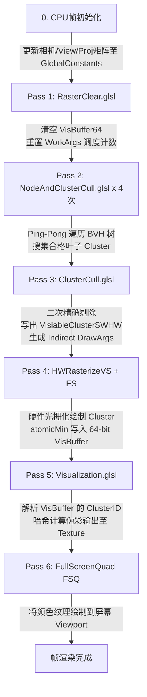

# OpenGL 5.5.4 实用 Nanite 渲染管线实现指南

欢迎来到 **Nanite在OpenGL 5.5.4中的实用实现方式** 项目！

本项目使用标准 **OpenGL 4.5+ (GLSL 450)** 重现了 Unreal Engine 5 (UE5) 核心的 **Nanite 虚拟化微细几何体 (Virtualized Micropolygon Geometry) 渲染管线**。

如果你对 Nanite 的原理一无所知，不用担心！本文档将从零开始，用通俗易懂的语言为你拆解 Nanite 的核心思想、GPU 驱动管线架构、数据结构设计、状态转换流程以及关键数学计算。

---

## 目录
1. [什么是 Nanite？为什么需要它？](#1-什么是-nanite为什么需要它)
2. [Nanite 的四大核心技术柱石](#2-nanite-的四大核心技术柱石)
3. [项目整体架构与渲染管线数据流](#3-项目整体架构与渲染管线数据流)
4. [GPU 内存与 SSBO 缓存数据结构全解](#4-gpu-内存与-ssbo-缓存数据结构全解)
5. [渲染管线的 6 大阶段与关键状态衔接](#5-渲染管线的-6-大阶段与关键状态衔接)
6. [关键数学计算与 Shader 逻辑拆解](#6-关键数学计算与-shader-逻辑拆解)
7. [项目代码与 Shader 文件目录结构](#7-项目代码与-shader-文件目录结构)
8. [如何编译与运行](#8-如何编译与运行)
9. [独立依赖管理说明](#9-独立依赖管理说明)

---

## 1. 什么是 Nanite？为什么需要它？

### 1.1 传统 3D 渲染的痛点
在传统游戏引擎（如 UE4、传统 OpenGL/DirectX 项目）中，渲染成千上万个高模（百万面级别的 3D 模型）会遇到两大致命瓶颈：
1. **CPU 提交开销（Draw Call 瓶颈）**：CPU 需要逐个模型绑定材质、设置 Matrix 并调用绘制指令。如果场景有几千个物体，CPU 会彻底卡死。
2. **顶点着色器与几何浪费（Vertex Overdraw & LOD 突变）**：
   - 当模型离相机很远时，一个包含 100 万个三角形的模型在屏幕上可能只占几十个像素！GPU 仍然要对 100 万个顶点逐个运行 Vertex Shader，造成极大的算力浪费。
   - 传统的 LOD（细节层次）需要美术手动制作 LOD0, LOD1, LOD2 几套网格，且在切换时屏幕上会有明显的“形状突变（LOD Popping）”。

### 1.2 Nanite 的革命性解法
UE5 的 Nanite 技术打破了传统管线：
- **簇化（Clustering）**：将模型拆分成许许多多微小的“几何簇（Cluster）”，每个 Cluster 固定包含约 **128 个三角形**。
- **层次化层次包围盒树（BVH Tree）**：将 Cluster 构建为多层级的层次树结构。
- **全 GPU 驱动（GPU-Driven Pipeline）**：从视锥体裁剪、LOD 选择到绘制命令生成，**完全由 GPU Compute Shader 在显存中自主完成**，CPU 每帧只需发起一次 dispatch 和一次 DrawCall！
- **Visibility Buffer (VisBuffer)**：不再使用包含大量材质贴图的传统 G-Buffer，而是用一个 64 位的 VisBuffer 记录每个像素由哪个 Cluster 的哪个三角形渲染，大幅降低写显存带宽。

---

## 2. Nanite 的四大核心技术柱石

```
+-----------------------------------------------------------------------------------+
|                                  Nanite 核心柱石                                  |
+--------------------------+--------------------------+-----------------------------+
| 1. Cluster 几何微簇化    | 2. BVH 树与连续 LOD 裁剪 | 3. GPU-Driven 间接绘制      |
| 将模型拆分为 128 三角形  | 计算屏幕空间误差像素大小 | CPU 0 介入，GPU 自动在显存  |
| 构成的独立基本渲染单元   | 动态决定展开节点或渲染叶 | 维护绘制参数 (DrawIndirect) |
+--------------------------+--------------------------+-----------------------------+
|                                4. VisBuffer (64-bit)                              |
| 像素点存储 [32-bit float 深度 + 24-bit PageID + 8-bit ClusterID]，GPU 原子Min 写入  |
+-----------------------------------------------------------------------------------+
```

---

## 3. 项目整体架构与渲染管线数据流

在本项目中，渲染一帧图像由 **6 个连续执行的 RenderPass** 组成，数据在 GPU SSBO（Shader Storage Buffer Object）缓冲区中流转：



---

## 4. GPU 内存与 SSBO 缓存数据结构全解

本项目在 GPU 显存中开辟了以下核心 SSBO 缓冲区：

### 4.1 `sWorkArgs[2]` (间接调度与绘制参数缓冲区 - 两个，用于 Ping-Pong)
大小：4MB。包含 Compute Shader 派发参数与 `glDrawArraysIndirect` 的命令结构：
- `mData[0]`: 间接绘制每个 Instance 的顶点数（固定为 384，即 128 个三角形 * 3 顶点）。
- `mData[1]`: 可见的 Cluster 总数量（作为 `glDrawArraysIndirect` 的 `instanceCount`）。
- `mData[5]`: 当前 BVH 节点层在 `MainAndPostNodeAndClusterBatches` 中的起始偏移。
- `mData[6]`: 当前 BVH 节点层待处理的节点数量。

### 4.2 `sMainAndPostNodeAndClusterBatches` (节点与 Cluster 批次缓冲区)
大小：4MB。划分为两个区域：
- **`mData[0 .. 1023]`**：BVH 树节点遍历队列（节点索引）。
- **`mData[1024 .. ]`**：遍历收集到的叶子 Cluster 列表，每组占 2 个 uint：
  - `mData[1024 + i*2 + 0]`: `pageIndex` (资源页索引)
  - `mData[1024 + i*2 + 1]`: `clusterOffset` (页内 Cluster 偏移)

### 4.3 `sVisiableClusterSWHW` (最终可见 Cluster 缓冲区)
大小：4MB。存储通过全部剔除测试、即将送入硬件光栅化渲染的 Cluster 列表（每个元素为 `uvec2(pageIndex, clusterIndex)`）。

### 4.4 `sVisBuffer64` (64 位 Visibility Buffer)
大小：`Width * Height * 8 Bytes` (1280x720 约 7.37 MB)。
每个像素为 `uint64_t`，打包结构如下：
```
+-----------------------------------+-----------------------------------+
|    高 32 位 (High 32-bit)         |      低 32 位 (Low 32-bit)        |
+-----------------------------------+-----------------------------------+
|  floatBitsToUint(gl_FragCoord.z)  | (pageIndex << 8) | (clusterIndex) |
|         (32-bit 浮点深度)         |     (24-bit 页码 + 8-bit Cluster) |
+-----------------------------------+-----------------------------------+
```
*注：由于高 32 位是深度值，GPU 执行 64 位 `atomicMin` 时，深度较小（离相机更近）的像素会自动覆盖深度大的像素，完美实现 GPU 硬件级 Z-Buffer！*

---

## 5. 渲染管线的 6 大阶段与关键状态衔接

### 阶段 1：`RasterClearPass` (Compute Shader)
- **调度线程**：`(160, 90, 1)`（覆盖 1280x720 像素，每个 ThreadGroup 处理 8x8 像素）。
- **主要职责**：
  1. 将 `VisBuffer64` 每一个像素重置为背景最大深度值 `0xFFFFFFFF00000000ul`。
  2. 仅由 `(0,0)` 号线程初始化 `sWorkArgs[0]` 和 `sWorkArgs[1]`：设置 `currentNodeOffset = 0`, `currentNodeCount = 1`（代表从根节点 0 开始遍历 BVH 树）。

### 阶段 2：`NodeAndClusterCullPass` (Compute Shader - 循环 4 次)
- **调度线程**：`(1, 1, 1)`。
- **状态衔接（Ping-Pong 双缓存机制）**：
  - 第 `i` 次循环（`i` 从 0 到 3）：
    - **读取** `sWorkArgs[i % 2]`（输入当前层的节点列表）。
    - **计算** 视锥体与投影屏幕误差（LOD 测试）。
    - **写出** 到 `sWorkArgs[(i+1) % 2]`（输出下一层的子节点列表）。
    - 如果遇到叶子节点，则将包含的 128-三角形 Cluster 追加写入 `sMainAndPostNodeAndClusterBatches` 缓冲区（偏移 1024 之后）。

### 阶段 3：`ClusterCullPass` (Compute Shader)
- **调度线程**：`(1, 1, 1)`。
- **主要职责**：
  - 遍历阶段 2 收集到的所有叶子 Cluster。
  - 再次计算每个 Cluster 的边界球（LOD Error & Edge Length）与当前相机的屏幕空间投影尺寸。
  - 剔除完全不可见或误差不达标的 Cluster，将通过测试的 Cluster 写入 `sVisiableClusterSWHW`。
  - 将通过测试的 Cluster 总数更新至 `sWorkArgs[0].mData[1]` (即 `instanceCount`)。

### 阶段 4：`HWRasterizePass` (Graphics Pipeline - 间接绘制)
- **绘制指令**：`sHWRasterizePass->ExecuteIndirect(sWorkArgs[0])` -> 调用 `glDrawArraysIndirect(GL_TRIANGLES, nullptr)`。
- **主要职责**：
  - **Vertex Shader (`HWRasterizeVS.glsl`)**：利用 `gl_InstanceID` 从 `sVisiableClusterSWHW` 取得 Cluster 信息，利用 `gl_VertexID` 解包网格顶点坐标，进行 `Model * View * Projection` 变换输出到 `gl_Position`。
  - **Fragment Shader (`HWRasterizeFS.glsl`)**：将 `gl_FragCoord.z` 转为 32 位 uint，与 Cluster 标识编码为 64 位 uint64，通过 `atomicMin(VisBuffer64.mData[pixelIndex], pixelValue64)` 原子更新 VisBuffer！

### 阶段 5：`VisualizationPass` (Compute Shader)
- **调度线程**：`(160, 90, 1)`。
- **主要职责**：
  - 读取 `VisBuffer64.mData[pixelIndex]`。
  - 提取低 32 位的 Cluster 标识：`clusterIndex = (pixelValue & 0xFFu) - 1`。
  - 使用 MurmurHash 算法根据 `clusterIndex` 伪随机生成一个专属 RGB 颜色。
  - 将 RGB 颜色写入 2D 纹理 `sVisualizationTexture` (`imageStore`)。

### 阶段 6：Full-Screen Quad Pass (Graphics Pipeline)
- **主要职责**：使用一个简单的 Fullscreen Quad 顶点/片段着色器，将 `sVisualizationTexture` 渲染贴到主屏幕的 BackBuffer 上，供用户实时观察。

---

## 6. 关键数学计算与 Shader 逻辑拆解

### 6.1 屏幕空间 LOD 误差投影计算 (`GetProjectionScales`)

在 [NodeAndClusterCull.glsl](Res/Shaders/NodeAndClusterCull.glsl) 与 [ClusterCull.glsl](Res/Shaders/ClusterCull.glsl) 中，Nanite 如何判断一个节点/Cluster 是否需要进一步细分或渲染？

> **分步图示**：见 [doc/figures/GetProjectionScales/](doc/figures/GetProjectionScales/)（00–05），[Code_Reading_Guide.md §6](doc/Code_Reading_Guide.md#6-关键算法getprojectionscales导读版) 有逐步说明。

原理是计算包围球在屏幕上的**像素投影大小**：
$$\text{ProjectedScale} = \frac{\text{Radius}}{\text{DistanceToCamera}} \times \text{ViewToPixels}$$

Shader 中的推导步骤：
1. **球心与圆切线三角关系**：计算相机到包围球中心距离平方 `DistToClusterSq = dot(Center, Center)`。
2. **切线余弦与正弦**：
   ```glsl
   float ScaledCosTheta = sqrt( max(0.0f, DistToClusterSq - Radius * Radius) );
   float ScaledSinTheta = Radius;
   ```
3. **根据投影矩阵与视口高度得到 LOD 缩放因子**（在 `scene.cpp` 中计算）：
   ```cpp
   const float ViewToPixels = 0.5f * sProjectionMatrix.v[5] * float(inCanvasHeight);
   const float LODScale = ViewToPixels / 1.0f;
   ```
4. **误差判定**：
   ```glsl
   if (projectionScales.x <= lodScale * inHierarchyNodeSlice.MaxParentLODError) {
       return true; // 屏幕误差小于阈值，说明当前层次足够精细，可停止细分并渲染！
   }
   ```

#### `ZNear` 常量：C++ 与 Shader 不一致（已知）

| | **当前 Demo** | **目标** |
|---|--------------|---------|
| C++ 透视近裁剪 | `scene.cpp` 中 `Perspective(..., near=1.0f, ...)` | 与 Shader 共用同一 near 值 |
| Shader `GetProjectionScales` | `ZNear = 10.0f` 硬编码（`ClusterCull.glsl` / `NodeAndClusterCull.glsl`） | 从 UBO 传入或与 C++ 对齐 |

C++ 近裁剪面曾在 [Nanite_BugFixes.md §3](doc/Nanite_BugFixes.md) 从 `10.0` 改为 `1.0` 以修复近距离方形裁切；Shader 内 `ZNear` 仍为 `10.0`，属于**遗留不一致**，不影响当前 Demo 主流程，但近距离 LOD 尺度计算可能与预期略有偏差。

### 6.2 VisBuffer 64位原子深度测试 (Z-Test)

在 [HWRasterizeFS.glsl](Res/Shaders/HWRasterizeFS.glsl)（约 L12–L15）：
```glsl
float depth = gl_FragCoord.z;                         // [0.0, 1.0] 的浮点深度
uint64_t pixelDepth = floatBitsToUint(depth);         // 转换为单调递增的 32位 uint
uint64_t pixelValue64 = (pixelDepth << 32) | uint64_t(V_PassThroughValue.x);
atomicMin(VisBuffer64.mData[pixelIndex], pixelValue64);
```
- **关键技巧**：IEEE 754 标准下，正浮点数（`0.0 ~ 1.0`）直接通过 `floatBitsToUint` 转为 32 位整型后，其大小关系**完全保持单调递增**（即 `depthA < depthB` 对应 `uintA < uintB`）。
- 因此，将其移位到高 32 位后，执行 `atomicMin` 能在没有标准 Depth Buffer 的情况下，单指令完成**硬件级 64 位深度比较与 VisBuffer 写入**！

---

## 7. 项目代码与 Shader 文件目录结构

```
OpenGL_NaniteInUE5.5.4/
│
├── src/                                   # C++ 源码（按模块分目录，详见 doc/Project_Structure.md）
│   ├── App/main.cpp                       # Win32 窗口与主循环
│   ├── Scene/scene.cpp                    # [核心] 管线组装与帧渲染
│   ├── Render/RenderPass.cpp              # Compute/Graphics Pass 封装
│   ├── Platform/oglcontext.cpp            # OpenGL 上下文与 GlobalConstants
│   ├── Camera/trackball_camera.cpp        # 轨迹球相机
│   ├── Math/                              # float4, matrix4, quaternion
│   └── Core/utils.cpp                     # 文件加载等工具
│
├── ThirdParty/GL/                         # GLEW 头文件
│
├── Res/                                   # 运行时资源（构建后复制到输出目录）
│   ├── mitsuba.bvh / mitsuba.nanitemesh   # Nanite 预构建数据
│   ├── Shaders/                           # GLSL（RasterClear → Visualization → FSQ）
│   └── Tools/                             # 离线编码工具源码（不参与 exe 编译）
│
├── doc/                                   # 技术文档与代码导读（完整索引见 doc/README.md）
│   ├── README.md                          # 文档地图与阅读顺序
│   ├── Code_Reading_Guide.md              # 代码导读（Pass 串联）
│   ├── Nanite_Data_Structures.md          # BVH / NaniteMesh / SSBO 数据结构参考
│   ├── Hardware_Rasterization_Guide.md    # 硬件光栅化（Pass4）
│   ├── GPU_Pipeline_Between_VS_and_FS.md  # VS/FS 间固定功能管线
│   └── Code_Optimization_TODO.md          # 优化待办
│
├── legacy/                                # 历史备份（不参与编译）
├── Nanite.sln / Nanite.vcxproj
└── README.md
```

---

## 8. 如何编译与运行

### 8.1 环境要求
- **操作系统**：Windows 10 / 11 (x64)
- **IDE / 编译器**：Visual Studio 2022 / 2026 (MSVC v143 / v145) 或 CMake 3.10+
- **显卡支持**：支持 **OpenGL 4.5** 及以上、包含扩展 `GL_ARB_gpu_shader_int64` 与 `GL_NV_shader_atomic_int64` 的 NVIDIA / AMD 独立显卡。

### 8.2 构建步骤

#### 方式 1：使用 CMake 命令行 / IDE 构建（推荐）
在 `01_GLInstance` 根目录下运行：
```powershell
# 配置构建工程
cmake -B out/build -S .

# 编译 Nanite 子项目
cmake --build out/build --target OpenGL_NaniteInUE5.5.4 --config Debug
```
编译完成后，可执行文件及所需资源（`Res/` 目录与 `glew32.dll`）会自动同步部署至输出目录（如 `out/build/OpenGL_NaniteInUE5.5.4/Debug/`）。

#### 方式 2：使用 Visual Studio 解决方案构建
1. 双击打开 `Nanite.sln` 解决方案。
2. 将编译配置切换为 **Debug | x64** 或 **Release | x64**。
3. 按 `F5` 运行或直接通过 MSBuild 命令行编译：
   ```powershell
   MSBuild.exe Nanite.sln /p:Configuration=Debug /p:Platform=x64
   ```

### 8.3 交互操作指南
- **鼠标左键拖拽**：旋转视角 (Trackball 轨迹球模式)。
- **鼠标中键拖拽**：平移相机。
- **鼠标右键拖拽 / 滚轮**：前后推拉/缩放视角。
- **键盘方向键 上 / 下**：切换 LOD 缩放等级。

---

## 9. 独立依赖管理说明

为保证该子项目的独立性与移植性，`OpenGL_NaniteInUE5.5.4` 采用了**完全独立且解耦的第三方依赖管理方案**：

### 9.1 解耦设计原则
- **独立于 Workspace 共享模块**：不依赖 workspace 根目录 `modules/` 下的共享第三方库（如 `glad`, `glfw`, `assimp` 等），避免因全局模块变更影响本子项目的稳定性。
- **自包含（Self-Contained）**：子项目在自身目录下包含编译与运行所需的所有第三方头文件、静态库及动态链接库，支持作为独立工程提取与部署。

### 9.2 依赖项明细表

| 依赖项名称 | 存放路径 / 引用位置 | 用途与说明 |
| :--- | :--- | :--- |
| **GLEW Header** | `ThirdParty/GL/` (`glew.h`, `wglew.h` 等) | OpenGL 扩展加载器头文件 |
| **GLEW Lib (x64)** | `ThirdParty/GLEW/lib/x64/glew32.lib` | 编译期静态导入库 |
| **GLEW DLL (x64)** | `ThirdParty/GLEW/bin/x64/glew32.dll` | 运行时动态链接库（构建后自动部署至可执行文件同级目录） |
| **OpenGL API** | `OpenGL::GL` (`opengl32.lib`) | Windows 系统原生 OpenGL 驱动库 |
| **Win32 & WinMM** | `winmm.lib`, `user32.lib`, `gdi32.lib` | Win32 窗口创建、WGL 像素格式/上下文管理及高精度计时器（`timeGetTime`） |

### 9.3 CMake 依赖配置实现细节
在 [OpenGL_NaniteInUE5.5.4/CMakeLists.txt](CMakeLists.txt) 中：
1. **Include 路径与 Unicode 定义**：
   ```cmake
   target_compile_definitions(${PROJECT_NAME} PRIVATE UNICODE _UNICODE)
   target_include_directories(${PROJECT_NAME} PRIVATE
       "${CMAKE_CURRENT_SOURCE_DIR}/src/App"
       "${CMAKE_CURRENT_SOURCE_DIR}/src/Core"
       "${CMAKE_CURRENT_SOURCE_DIR}/src/Math"
       "${CMAKE_CURRENT_SOURCE_DIR}/src/Platform"
       "${CMAKE_CURRENT_SOURCE_DIR}/src/Camera"
       "${CMAKE_CURRENT_SOURCE_DIR}/src/Render"
       "${CMAKE_CURRENT_SOURCE_DIR}/src/Scene"
       "${CMAKE_CURRENT_SOURCE_DIR}/ThirdParty"
   )
   ```
2. **独立库链接**：
   ```cmake
   set(GLEW_LIB "${CMAKE_CURRENT_SOURCE_DIR}/ThirdParty/GLEW/lib/x64/glew32.lib")
   target_link_libraries(${PROJECT_NAME} PRIVATE ${GLEW_LIB} OpenGL::GL winmm)
   ```
3. **自动化资源与 DLL 部署（Post-Build）**：
   ```cmake
   # 自动同步 Res/ 运行资源（Shader、BVH 树及模型网格）
   add_custom_command(TARGET ${PROJECT_NAME} POST_BUILD
       COMMAND ${CMAKE_COMMAND} -E copy_directory
           "${CMAKE_CURRENT_SOURCE_DIR}/Res"
           "$<TARGET_FILE_DIR:${PROJECT_NAME}>/Res"
   )
   # 自动部署 glew32.dll 至输出目录
   add_custom_command(TARGET ${PROJECT_NAME} POST_BUILD
       COMMAND ${CMAKE_COMMAND} -E copy_if_different
           "${CMAKE_CURRENT_SOURCE_DIR}/ThirdParty/GLEW/bin/x64/glew32.dll"
           "$<TARGET_FILE_DIR:${PROJECT_NAME}>/glew32.dll"
   )
   ```

