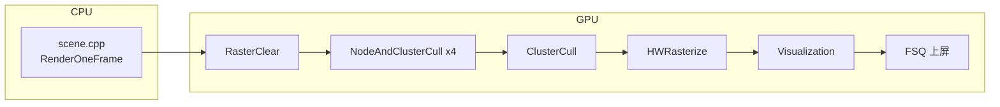
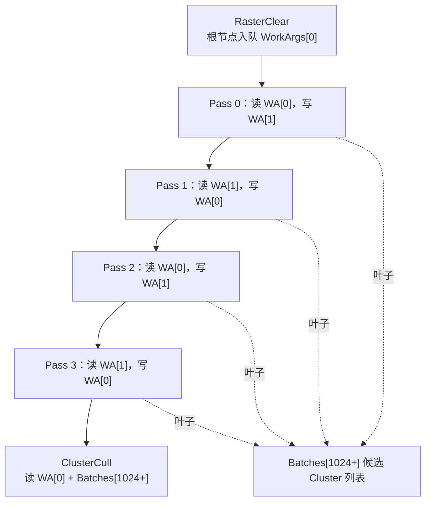
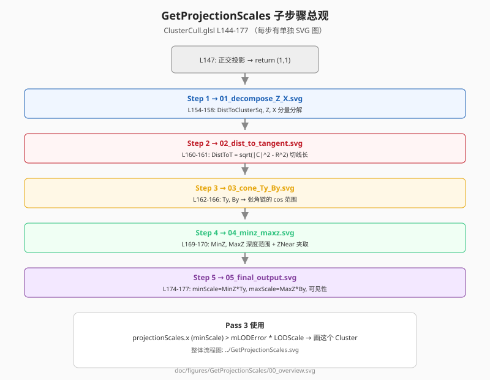

# Nanite OpenGL 项目 — 代码导读

> 面向「第一次读本项目源码」的开发者。  
> 配合 [README.md](../README.md)（原理与数学）、[Nanite_Data_Structures.md](./Nanite_Data_Structures.md)（BVH/几何数据结构查表）、[GPU_Driven_SSBO_Layout_Guide.md](./GPU_Driven_SSBO_Layout_Guide.md)（缓冲布局）、[Code_Optimization_TODO.md](./Code_Optimization_TODO.md)（后续重构计划）使用。文档总索引见 [doc/README.md](./README.md)。

---

## 1. 先建立全局图景（5 分钟）

### 1.1 一帧里发生了什么

CPU 每帧只做三件事：**更新相机矩阵 → 按顺序执行 6 个 Pass → 全屏显示纹理**。  
剔除、LOD 选择、绘制实例数、VisBuffer 写入，全部在 GPU 上完成。



### 1.2 每个 Pass 只回答一个问题

| 顺序 | Pass | Shader / 入口 | 核心问题 |
|:----:|------|---------------|----------|
| 0 | 更新常量 | `scene.cpp` → `sGlobalConstants` | 相机在哪？LOD 缩放多少？ |
| 1 | 清空与复位 | `RasterClear.glsl` | VisBuffer 和 WorkArgs 本帧从什么状态开始？ |
| 2 | BVH 遍历 | `NodeAndClusterCull.glsl` ×4 | 树走到哪一层可以停？叶子上有哪些**候选** Cluster？（为何 ×4 见 §4.5） |
| 3 | Cluster 精筛 | `ClusterCull.glsl` | 候选 Cluster 里哪些**真的该画**？`instanceCount` 是多少？ |
| 4 | 硬件光栅化 | `HWRasterizeVS.glsl` + `HWRasterizeFS.glsl` | 把可见 Cluster 画进 VisBuffer64 |
| 5 | 伪彩可视化 | `Visualization.glsl` | 把 VisBuffer 变成人能看的 RGB 图 |
| 6 | 上屏 | `fsqVS.glsl` + `fsqFS.glsl` | 贴到默认帧缓冲 |

### 1.3 三条「数据主线」

读代码时始终盯住这三条线在 Pass 之间的传递：

1. **WorkArgs（`sWorkArgs[0/1]`）** — Ping-Pong 调度 + 最终 `DrawIndirect` 参数  
2. **MainAndPostNodeAndClusterBatches** — BVH 节点栈（前 1024 uint）+ 候选 Cluster 列表（1024 之后）  
3. **VisiableClusterSWHW → VisBuffer64** — 可见簇列表 → 逐像素 64 位可见性缓冲  

---

## 2. 推荐阅读顺序

### 2.1 第一轮：跟数据流（不抠公式）

| 步骤 | 文件 | 关注什么 |
|:----:|------|----------|
| 1 | `scene.cpp` → `Init()` | 创建了哪些 SSBO、每个 Pass 绑定了什么 binding |
| 2 | `scene.cpp` → `RenderOneFrame()` | 6 个阶段调用顺序与注释块 |
| 3 | `RenderPass.cpp` | Compute / Indirect Draw 如何绑 UBO、SSBO、`glDispatchCompute` |
| 4 | `Res/Shaders/RasterClear.glsl` | WorkArgs 初始值、`VisBuffer64` 清空格式 |
| 5 | `Res/Shaders/ClusterCull.glsl` | **最短**的剔除 Pass，理解候选列表 → 可见列表 |
| 6 | `Res/Shaders/NodeAndClusterCull.glsl` | BVH 四叉树展开与叶子收集 |
| 7 | `Res/Shaders/HWRasterizeVS.glsl` | `gl_InstanceID` / `gl_VertexID` 如何定位 Cluster 与顶点 |
| 8 | `Res/Shaders/HWRasterizeFS.glsl` | `atomicMin` 写 VisBuffer |
| 9 | `Res/Shaders/Visualization.glsl` | 从 64 位值解出 Cluster 并上色 |

### 2.2 第二轮：抠细节

| 主题 | 文件 / 文档 |
|------|-------------|
| SSBO `mData[]` 布局 | [GPU_Driven_SSBO_Layout_Guide.md](./GPU_Driven_SSBO_Layout_Guide.md) |
| 间接绘制 | [OpenGL_Indirect_Drawing_Guide.md](./OpenGL_Indirect_Drawing_Guide.md) |
| Compute 线程与边界 | [GLSL_ComputeShader_InvocationID_Guide.md](./GLSL_ComputeShader_InvocationID_Guide.md) |
| Nanite 网格二进制 | `Res/Tools/NaniteEncode.cpp`（UE 参考）、`Res/mitsuba.nanitemesh` |
| BVH 二进制 | `Res/mitsuba.bvh` |
| 已知问题与修复记录 | [Nanite_BugFixes.md](./Nanite_BugFixes.md) |

### 2.3 用 RenderDoc 对照读（强烈推荐）

1. 捕获一帧，按 `SCOPED_EVENT` 名称展开：`RasterClear` → `NodeAndClusterCull_0..3` → `ClusterCull` → `HWRasterize` → `Visualization`  
2. 查看 SSBO：`WorkArgs[0]` 在 `ClusterCull` 后 `mData[1]` 应为可见 Cluster 数  
3. 查看 `VisiableClusterSWHW` 前几项 `(pageIndex, clusterIndex)` 是否与预期一致  

---

## 3. C++ 入口地图

### 3.1 `scene.cpp` — 场景与管线编排

```
Init()
  ├─ 相机 / 投影 / GlobalConstants
  ├─ 加载 mitsuba.bvh、mitsuba.nanitemesh → SSBO
  ├─ 创建 WorkArgs[2]、Batches、VisBuffer64、VisiableClusterSWHW
  └─ 构建各 RenderPass（绑定 UBO/SSBO/Shader）

RenderOneFrame()
  ├─ 更新 ViewMatrix、LODScale → glBufferSubData(GlobalConstants)
  ├─ sRasterClearPass->Execute()
  ├─ sNodeAndClusterCullPasses[0..3]->Execute()   // BVH 四层 Ping-Pong，见 §4.5
  ├─ sClusterCullPass->Execute()
  ├─ sHWRasterizePass->ExecuteIndirect(sWorkArgs[0])
  ├─ sVisualizationPass->Execute()
  └─ FSQ 绘制 sVisualizationTexture
```

文件顶部 `//init args` 注释行是早期管线速记，与下方 `Init()` 内分 Pass 注释一致，以 `RenderOneFrame()` 分阶段注释为准。

### 3.2 `RenderPass.cpp` — 单 Pass 执行器

- **Compute Pass**：`glUseProgram` → 绑 UBO/SSBO/Image → `glDispatchCompute` → `glMemoryBarrier`  
- **Graphics Indirect**：`glDrawArraysIndirect`，实例数来自 GPU 写入的 `WorkArgs[0].mData[1]`  

`Execute()` 末尾使用 `GL_ALL_BARRIER_BITS` 是为简单保证 Pass 间可见性；见 [Code_Optimization_TODO.md](./Code_Optimization_TODO.md) 关于收窄屏障的待办。

### 3.3 `oglcontext.h` — `GlobalConstants`

与所有 Shader 中 `layout(binding=0) uniform GlobalConstants` **内存布局必须一致**。

| 成员 | Shader 用法 |
|------|-------------|
| `ProjectionMatrix` / `ViewMatrix` / `ModelMatrix` | 变换与投影 |
| `Misc0` | `x`：当前 Mip/LOD 级别索引（方向键切换） |
| `CameraPositionWS.xyz` | 世界空间相机位置；剔除前会减到「相机相对空间」 |
| `CameraPositionWS.w` | **LODScale** — 屏幕像素尺度，用于 LOD 阈值 |
| `ViewDirectionWS.xyz` | 相机前向（用于 `GetProjectionScales` 中的 Z） |
| `ViewDirectionWS.w` | **LODScaleHW** — 硬件光栅化侧 LOD 缩放（预留/部分 Pass） |

---

## 4. GPU 缓冲速查

### 4.1 `sWorkArgs[0/1]` — `uint mData[]` 语义

与 OpenGL `DrawArraysIndirectCommand` 前几个字段共用同一块缓冲（`std430` 紧凑排列）：

| 下标 | 名称（导读用） | 含义 |
|:----:|----------------|------|
| `[0]` | `vertexCount` | 每个 Instance 的顶点数，固定 **384**（128 三角 × 3） |
| `[1]` | `instanceCount` | 可见 Cluster 数量；`ClusterCull` 写入，`DrawIndirect` 读取 |
| `[2]` | `firstVertex` | 间接绘制首顶点（本项目多为 0） |
| `[3]` | `baseInstance` | 间接绘制 base instance（本项目多为 0） |
| `[5]` | `nodeListOffset` | 当前 BVH 层节点 ID 在 Batches 缓冲中的起始下标 |
| `[6]` | `nodeCount` | 当前层待处理节点个数 |

Pass 2 使用 **Ping-Pong**：Pass `i` 读 `sWorkArgs[i%2]`，写 `sWorkArgs[(i+1)%2]`。  
Pass 3 之后以 `sWorkArgs[0]` 作为间接绘制缓冲。

### 4.5 为什么 `NodeAndClusterCull` 要跑 4 次 Ping-Pong？

对应代码：`src/Scene/scene.cpp` 中 `RenderOneFrame()` 的 Pass 2 循环，以及 `Init()` 里创建 4 个 `sNodeAndClusterCullPasses[i]`。

#### 每次 Pass 在干什么

`NodeAndClusterCull.glsl` 做的是 **按层（breadth-first）遍历 BVH**，不是一次递归到底。每一轮 Compute 只处理 **当前层** 的节点列表：

```
第 i 次 Pass：
  读 WorkArgs[current]  →  mData[5] = 本层列表在 Batches 中的起始下标
                         →  mData[6] = 本层待处理节点个数
  遍历这些节点：
    · 叶子 + LOD 达标  →  把 Cluster 追加到 Batches[1024+]（候选列表，全局累加）
    · 非叶 + LOD 达标  →  子节点 ID 写入「下一层」节点栈
  写 WorkArgs[next]     →  更新下一层的 mData[5] / mData[6]
```

`RasterClear` 把遍历起点设为 **1 个根节点**（`mData[6]=1`，节点 ID 在 `Batches[0]`）。

#### 四次循环与读写缓冲对应关系

`Init()` 里 Pass `i` 绑定：`current = sWorkArgs[i % 2]`，`next = sWorkArgs[(i+1) % 2]`。

| Pass `i` | 读（current） | 本层处理对象 | 写（next） |
|:--------:|---------------|--------------|------------|
| 0 | `WorkArgs[0]` | 根节点（第 0 层） | `WorkArgs[1]` |
| 1 | `WorkArgs[1]` | 第 1 层 | `WorkArgs[0]` |
| 2 | `WorkArgs[0]` | 第 2 层 | `WorkArgs[1]` |
| 3 | `WorkArgs[1]` | 第 3 层 | `WorkArgs[0]` |

4 次循环 = 从根出发 **最多向下展开 4 轮层遍历**。当前 `mitsuba.bvh` 的树深度在该范围内，叶子上的 Cluster 会被收进 `Batches[1024+]`。

4 次结束后，**最后一次写入的是 `WorkArgs[0]`**，因此 `ClusterCull` 与 `HWRasterize` 都绑定 `sWorkArgs[0]`。



#### 为什么要 Ping-Pong（两块 WorkArgs）

同一轮里不能既读「当前层节点栈」又写「下一层节点栈」到 **同一块** `WorkArgs`，否则会覆盖尚未读完的节点 ID。

```
WorkArgs[0]  ←→  WorkArgs[1]
  current          next（下一层队列）
```

`Batches[0..1023]` 里的节点栈随层推进而 **追加写入**（`mData[5]` 指向新层的起始 offset）；`Batches[1024+]` 的候选 Cluster 列表则 **全程累加**，不参与 Ping-Pong。

#### 为什么是 4（硬编码）而不是动态深度

这是本项目的 **简化实现**，并非 UE 正式 Nanite 的做法：

- `for (int i = 0; i < 4; i++)` 与 `Init()` 里建 4 个 `RenderPass` 均为 **写死的常数**；
- Shader **不会** 在 `mData[6]==0` 时提前退出循环；
- **不会** 从 BVH 元数据读取树高再决定 dispatch 次数。

含义可以概括为：

> 当前 `mitsuba.bvh` 从根到叶子，**4 层遍历足够**。

| 情况 | 后果 |
|------|------|
| BVH 比 4 层更深 | 更深层节点不会再被处理，可能 **漏掉 Cluster** |
| BVH 更浅 | 多跑的几轮 `nodeCount` 可能为 0，循环空转，一般 **无害** |

换用更深网格时，需增大循环次数，或改为「`nodeCount==0` 则停止」的动态调度。详见 [Code_Optimization_TODO.md](./Code_Optimization_TODO.md) §4.1。

#### 与 Pass 3 的分工（易混）

| | Pass 2（×4） | Pass 3（×1） |
|---|-------------|-------------|
| 输入 | BVH 树 + 逐层节点队列 | Pass 2 写入的 **候选** Cluster 列表 |
| LOD 问法 | 误差够小了吗？可以 **停在这一层** 吗？ | 误差够大了吗？这个 Cluster **该画** 吗？ |
| 输出 | `Batches[1024+]` 候选列表；`WorkArgs[0].mData[1]` 仍为候选计数 | `VisiableClusterSWHW` + 最终 `instanceCount` |

### 4.2 `sMainAndPostNodeAndClusterBatches`

| 区域 | 下标范围 | 内容 |
|------|----------|------|
| 节点栈 | `[0 .. 1023]` | 待遍历的 BVH 节点索引（每层 Ping-Pong 写入） |
| Cluster 候选列表 | `[1024 ..]` | 交错存储：`[pageIndex, clusterIndex, ...]`（含义见 **§4.6**） |

### 4.3 `sVisiableClusterSWHW`

最终可见 Cluster 列表，格式与候选列表相同：`uvec2(pageIndex, clusterIndex)` 或等价的 `uint` 交错数组。  
`HWRasterizeVS` 用 `gl_InstanceID` 索引此项。

### 4.4 `sVisBuffer64`

每像素一个 `uint64_t`：

```
┌─────────────────────────────────────────────────────────────┐
│  高 32 位：float 深度（floatBitsToUint，保序）              │
│  低 32 位：Payload = (pageIndex << 8) | (clusterIndex + 1)  │
└─────────────────────────────────────────────────────────────┘
```

- 清空值：`0xFFFFFFFF00000000`（最远深度 + 空 payload）  
- `HWRasterizeFS`：`atomicMin` 保留更近的片元  
- `Visualization`：取低 32 位，`& 0xFF` 得 `clusterIndex`  

### 4.6 BVH 与 NaniteMesh

Pass 2 读 **BVH** 做裁剪；Pass 3/4 读 **NaniteMesh** 取几何。二者通过 `(pageIndex, clusterIndex)` 衔接。

**完整字段表、三层分类、寻址案例、字节/`uint` 对照、与 UE 差异** → 见独立参考文档：

**[Nanite_Data_Structures.md](./Nanite_Data_Structures.md)**

本节只保留读代码时的最小记忆点：

| 记忆点 | 一句话 |
|--------|--------|
| 两套文件 | `mitsuba.bvh` 管「该不该细化」；`mitsuba.nanitemesh` 管「三角形在哪」 |
| 衔接键 | BVH 叶子写出 `(pageIndex, clusterIndex)` → `Batches[1024+]` 候选列表 |
| 四叉 vs 分页 | BVH 每节点 **4 个子槽位**；每 Page 的 Cluster 个数 **不固定** |
| 寻址 | `GetClusterInfo(page, cluster)`：全局页表 → 页头偏移表 → Cluster 头 |
| 易错 | 偏移表存 **字节**，`mData[]` 按 **uint** 索引，访问前常需 `/4` |

> **图示**：`doc/figures/BVH_NaniteMesh/00_overview.svg`（总览），`01`–`07` 分步图；与 [Nanite_Data_Structures.md §2–§3](./Nanite_Data_Structures.md) 一一对应。

逐行代码注释：`ClusterCull.glsl` 的 `GetClusterInfo`；BVH 叶子展开：`NodeAndClusterCull.glsl`。

---

## 5. Shader 分层阅读法

每个复杂 Shader 按三层理解，**不要从 `main()` 第一行硬啃到底**：

```
┌──────────────────────────────────────┐
│ Layer 3 — main()：读写哪些 buffer    │  管线 IO、循环边界
├──────────────────────────────────────┤
│ Layer 2 — 判据：该不该停 / 该不该画   │  LOD 与阈值比较
├──────────────────────────────────────┤
│ Layer 1 — 解包：uint[] → 结构体       │  GetClusterInfo、UnpackHierarchyNodeSlice
└──────────────────────────────────────┘
```

### 5.1 `NodeAndClusterCull.glsl`（Pass 2）

> C++ 侧为何循环 4 次、Ping-Pong 如何绑定，见 **§4.5**。  
> BVH 四叉 vs `pageIndex`/`clusterIndex` 区别，见 **§4.6**。

| 层次 | 函数 / 块 | 说明 |
|------|-----------|------|
| L1 | `BitFieldExtractU32`、`UnpackHierarchyNodeSlice`、`GetHierarchyNodeSlice` | 从 `mitsuba.bvh` 解包 UE Nanite 风格四叉 BVH 子节点 |
| L2 | `GetProjectionScales`、`ShouldVisiteChild` | 屏幕投影尺度 vs `MaxParentLODError * LODScale` |
| L3 | `main` 双重循环 | 遍历当前层节点 → 叶子写 Batches[1024+]，非叶写下一层节点栈 |

**LOD 方向（易混）**：`projectionScales.x <= threshold` → **足够细，可以在此停止**（访问该子树：叶子则收集 Cluster，非叶则入队子节点）。

### 5.2 `ClusterCull.glsl`（Pass 3）

> `(pageIndex, clusterIndex)` 如何定位 NaniteMesh 中的 Cluster，见 **§4.6**。

| 层次 | 函数 / 块 | 说明 |
|------|-----------|------|
| L1 | `GetClusterInfo` | 从 `mitsuba.nanitemesh` 按 page/cluster 二维地址解包元数据 |
| L2 | `GetProjectionScales` + `if (projectionScales.x > mLODError * lodScale)` | **与 Pass 2 比较方向相反**：这里是要**绘制**的簇 |
| L3 | `main` for 循环 | 读候选列表 → 写 `VisiableClusterSWHW` → 写 `mData[1]` |

### 5.3 `HWRasterizeVS.glsl` / `HWRasterizeFS.glsl`（Pass 4）

- **VS**：`instance` = 可见列表下标；`vertex` = 簇内 0..383；从 NaniteMesh 拉取索引与位置，MVP 变换；传出 packed cluster id。  
- **FS**：无传统颜色输出；`atomicMin` 竞争写入 VisBuffer。  
- **硬件光栅化概念**（为何只有本 Pass 是 Draw、VS/FS 与 Compute 有何不同）：见 [Hardware_Rasterization_Guide.md](./Hardware_Rasterization_Guide.md)。  
- **VS 与 FS 之间**（裁剪、透视除法、视口、光栅化）：见 [GPU_Pipeline_Between_VS_and_FS.md](./GPU_Pipeline_Between_VS_and_FS.md)。  

### 5.4 `RasterClear.glsl` / `Visualization.glsl`（Pass 1 / 5）

- **RasterClear**：8×8 工作组清空全屏 VisBuffer；仅 `(0,0)` 线程写 WorkArgs 初值。  
- **Visualization**：8×8 工作组，MurmurHash 伪彩；分辨率 **1280×720 硬编码**（与 `Init` 默认画布一致）。  

---

## 6. 关键算法：`GetProjectionScales`（导读版）

**输入**：相机相对空间下的包围球 `(center.xyz, radius.w)`  
**输出**：`vec2(minScale, maxScale)` — 球在屏幕上投影尺寸的近似范围（用于与 `LODError` 比较）

**用途**：

- BVH 阶段：与 **父级** `MaxParentLODError` 比 → 判断是否已足够细  
- Cluster 阶段：与 **自身** `mLODError` 比 → 判断是否值得绘制  

完整推导见 [README.md](../README.md) §6。实现上复制在 `NodeAndClusterCull.glsl` 与 `ClusterCull.glsl`（后续可抽到公共头，见优化待办）。

### 6.1 分步图示（对应 `ClusterCull.glsl` L145–177）

> 图示目录：`doc/figures/GetProjectionScales/`。在支持 SVG 预览的 Markdown 阅读器中可直接查看。

| 步骤 | 图示 | 代码行 | 做什么 |
|:--:|------|--------|--------|
| 总览 | [00_overview.svg](./figures/GetProjectionScales/00_overview.svg) | L145–177 | 正交分支 + 五步流水线 |
| 1 | [01_decompose_Z_X.svg](./figures/GetProjectionScales/01_decompose_Z_X.svg) | L154–158 | 球心分解为视线方向 `Z` 与垂直分量 `X` |
| 2 | [02_dist_to_tangent.svg](./figures/GetProjectionScales/02_dist_to_tangent.svg) | L160–164 | 切线三角关系：`DistToT`、`ScaledCos/SinTheta` |
| 3 | [03_cone_Ty_By.svg](./figures/GetProjectionScales/03_cone_Ty_By.svg) | L165–167 | 计算 `Ty`、`By`（投影锥角相关） |
| 4 | [04_minz_maxz.svg](./figures/GetProjectionScales/04_minz_maxz.svg) | L168–171 | `MinZ`/`MaxZ` 夹到 `ZNear` 以上 |
| 5 | [05_final_output.svg](./figures/GetProjectionScales/05_final_output.svg) | L172–177 | 返回 `(minScale, maxScale)` 或 `(0,0)` |



### 6.2 `ZNear` 不一致（C++ vs Shader）

| | **当前 Demo** | **目标** |
|---|--------------|---------|
| C++ | `scene.cpp` 透视 `near = 1.0f` | 单一来源 |
| Shader | `GetProjectionScales` 内 `ZNear = 10.0f` | 从 UBO 读取或与 C++ 对齐 |

详见 [README.md §6.1](../README.md#61-屏幕空间-lod-误差投影计算-getprojectionscales)、[Nanite_BugFixes.md §3](./Nanite_BugFixes.md)。

---

## 7. 资源与 Shader 文件索引

完整目录说明见 [Project_Structure.md](./Project_Structure.md)。

```
OpenGL_NaniteInUE5.5.4/
├── src/
│   ├── App/main.cpp              # 窗口与主循环
│   ├── Scene/scene.cpp           # ★ 管线编排、资源创建、每帧更新
│   ├── Render/RenderPass.cpp     # Pass 执行、Dispatch / DrawIndirect
│   ├── Platform/oglcontext.h     # GlobalConstants、GL 工具
│   └── Math/ / Camera/ / Core/   # 数学、相机、工具
├── Res/
│   ├── Shaders/                  # 全部 GLSL Pass
│   ├── mitsuba.bvh / .nanitemesh
│   └── Tools/NaniteEncode.cpp    # 离线编码参考（不参与编译）
├── ThirdParty/GL/                # GLEW
└── doc/                          # 专题文档（含本文）
```

---

## 8. 常见困惑 FAQ

**Q：为什么 NodeAndClusterCull 要跑 4 次？**  
A：详见 **§4.5**。简述：每轮 Pass 只展开 BVH **一层**；两块 `WorkArgs` Ping-Pong 交替存当前层/下一层节点队列；`4` 是为 `mitsuba.bvh` **写死的层数上限**，不是引擎自动算出来的树高。

**Q：一个 Page 是不是对应 4 个 `clusterIndex`？**  
A：**不是。** 4 指的是 BVH **每个节点 4 个子分支**（四叉树），不是每页 4 个 Cluster。每页 Cluster 个数由 `NaniteMesh.mData[pageBase]` 决定；`clusterIndex` 是页内编号 `0..N-1`。详见 **§4.6**。

**Q：`mData` 里为什么经常 `/4`？`1+clusterCountOnPage` 页头里写什么？**  
A：偏移表存的是 **字节**，`mData[]` 按 **uint（4字节）** 索引，故 `/4`。页头 = **1 个 uint 个数 + clusterCountOnPage 个 uint 偏移表**，不含顶点几何。全局文件头同理：`mData[0]` 是页数，`mData[1+pageIndex]` 是各页偏移。详见 [Nanite_Data_Structures.md §3、§6](./Nanite_Data_Structures.md)。

**Q：Pass 2 和 Pass 3 的 LOD 比较为什么看起来「反着」？**  
A：Pass 2 问的是「误差是否已经小到可以**停在这一层**」；Pass 3 问的是「误差是否大到**值得画这个 Cluster**」。一个是树遍历剪枝，一个是绘制门控。

**Q：`gl_InstanceID` 从哪来？**  
A：`ClusterCull` 写入 `WorkArgs[0].mData[1]`，`glDrawArraysIndirect` 读取为 instanceCount，每个 instance 对应 `VisiableClusterSWHW` 中一个 Cluster。

**Q：为什么 Compute Shader 很多是 `local_size_x=1`？**  
A：当前实现用单线程 for 循环简化调试；不是 Nanite 的最终形态，并行化见优化待办。

**Q：注释里的 Visiable 是拼写错误吗？**  
A：是历史命名，与符号 `VisiableClusterSWHW` 一致；重命名列入优化待办，不影响阅读时把它当作 Visible 即可。

---

## 9. 与优化待办的边界

- **本文 + Shader 内注释**：帮助理解**现有**行为。  
- **[Code_Optimization_TODO.md](./Code_Optimization_TODO.md)**：记录**尚未实施**的结构/性能改进。  
- 导读过程中若发现文档与代码不一致，以**代码为准**并更新文档或记入 BugFixes。

---

*最后更新：与 OpenGL_NaniteInUE5.5.4 Pass 6 阶段管线一致。*
