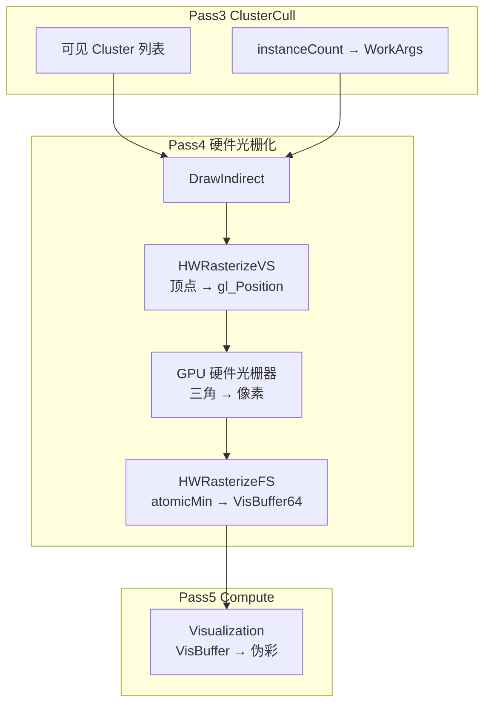

# 硬件光栅化（HW Rasterization）— 结合本项目的直观说明

> 本 Demo **只实现了硬件光栅化路径**（Pass 4）。软件光栅化（Compute 手写逐像素）见 [Nanite_SW_vs_HW_Rasterization_Guide.md](./Nanite_SW_vs_HW_Rasterization_Guide.md)。

---

## 1. 一句话是什么？

**硬件光栅化 = 把三角形交给 GPU 芯片里固定的「画三角机器」，由它自动算出「这个三角盖住了屏幕哪些像素」。**

你写的 Shader 只负责：

- **VS**：每个顶点在哪（`gl_Position`）
- **FS**：每个被盖住的像素做什么（本 Demo：写 VisBuffer）

**中间「三角 → 像素列表」这一步没有 .glsl 文件**，是 GPU 固定功能，这就是「硬件」的含义。

裁剪、透视除法、视口变换、光栅化等 **VS 与 FS 之间的逐步说明** 见 [GPU_Pipeline_Between_VS_and_FS.md](./GPU_Pipeline_Between_VS_and_FS.md)。

---

## 2. 在本项目 6 个 Pass 里，谁算「硬件光栅化」？

| Pass | Shader | 触发方式 | 是否 HW 光栅化 |
|------|--------|----------|----------------|
| 1 RasterClear | Compute ×1 | `Dispatch` | ❌ 不画三角，只清 Buffer |
| 2 NodeAndClusterCull ×4 | Compute ×1 | `Dispatch` | ❌ BVH 遍历 |
| 3 ClusterCull | Compute ×1 | `Dispatch` | ❌ LOD 筛选 |
| **4 HWRasterize** | **VS + FS** | **`glDrawArraysIndirect`** | **✅ 唯一 HW 光栅化** |
| 5 Visualization | Compute ×1 | `Dispatch` | ❌ 读 VisBuffer 伪彩 |
| 6 FSQ | VS + FS | `Draw(3)` | ✅ 也是 Graphics，但是「全屏三角上屏」，不是 Nanite 几何 |

**规律**：

- **Compute Pass**：一个 `.glsl`，线程自己选坐标 `(gl_GlobalInvocationID)`，**没有三角形输入**。
- **Graphics Pass（HW）**：`Draw` / `DrawIndirect`，必须有 **VS 输出三角形顶点**，GPU 才光栅化。

---

## 3. 整体数据流（Pass 3 → 4 → 5）

```
Pass3 ClusterCull
  输出 VisiableClusterSWHW[]     = 可见 Cluster 列表 (pageIndex, clusterIndex)
  输出 WorkArgs[0].mData[1]      = instanceCount（要画几个 Cluster）

Pass4 HWRasterize  ←── 硬件光栅化
  glDrawArraysIndirect(WorkArgs[0])
    vertexCount   = 384   （每个 Cluster 最多 128 三角 × 3 顶点）
    instanceCount = 上一步写入的可见簇数

  每个 Instance = 一个 Cluster
  每个 Vertex   = 簇内索引流里的一条（0..383）

  VS → gl_Position + Payload
  【GPU 硬件】三角 → 覆盖哪些像素 → gl_FragCoord
  FS → atomicMin → VisBuffer64[pixel]

Pass5 Visualization
  Compute 逐像素读 VisBuffer → 伪彩纹理（不再画三角）
```

对应代码：`src/Scene/scene.cpp` 中 `sClusterCullPass` → `sHWRasterizePass->ExecuteIndirect` → `sVisualizationPass`。

---

## 4. 硬件光栅化管线分步（Pass 4 详解）

### 4.1 CPU/GPU 发起绘制

```cpp
// scene.cpp — instanceCount 由 ClusterCull 在 GPU 上写入 WorkArgs
sHWRasterizePass->ExecuteIndirect(sWorkArgs[0]);
// 内部 ≈ glDrawArraysIndirect(GL_TRIANGLES, WorkArgs[0])
```

`WorkArgs[0]` 前几项（与 `VkDrawIndirectCommand` 布局一致）：

| mData 下标 | 含义 | 典型值 |
|------------|------|--------|
| `[0]` | vertexCount | 384 |
| `[1]` | instanceCount | 可见 Cluster 数量 |
| `[2]` | firstVertex | 0 |
| `[3]` | firstInstance | 0 |

**一次 Draw = 画 `instanceCount` 个 Cluster，每个 Cluster 提交 384 个顶点组成的三角列表。**

---

### 4.2 顶点着色器（VS）— 你只负责「顶点」

文件：`Res/Shaders/HWRasterizeVS.glsl`

```
gl_InstanceID  →  第几个可见 Cluster（查 VisiableClusterSWHW）
gl_VertexID    →  该 Cluster 索引流第几条（0..383，不是全网格顶点号）

流程：
  (page, cluster) → GetClusterInfo → 读 NaniteMesh 索引表 + 位置池
  → ModelMatrix → 减相机 → View → Projection
  → gl_Position（裁剪空间）
  → V_PassThroughValue.x = Payload（给 FS 写 VisBuffer 低 32 位）
```

VS **不知道**也**不需要知道**三角形盖住屏幕哪块——那是下一步硬件的事。

---

### 4.3 硬件光栅化器（Fixed-Function）— 你看不见的「黑盒」

对每一个三角形（每 3 个连续顶点），GPU 芯片自动完成裁剪、透视除法、视口变换与光栅化（**逐步详解**见 [GPU_Pipeline_Between_VS_and_FS.md](./GPU_Pipeline_Between_VS_and_FS.md)）：

```
1. 裁剪 / 透视除法 / 视口变换
2. 判断三角在屏幕上的 2D 范围
3. 对范围内每个像素生成一个「片元 (Fragment)」
4. 为每个片元准备：
     gl_FragCoord.xy  — 像素坐标
     gl_FragCoord.z   — 插值后的深度
     以及从 VS 插值（flat）过来的 Payload
```

示意（一个三角盖住 5 个像素，就会启动 5 次 FS）：

```
屏幕像素网格
┌───┬───┬───┬───┐
│   │ ■ │ ■ │   │     ■ = 该三角覆盖 → 硬件生成片元 → 跑 FS
├───┼───┼───┼───┤
│   │ ■ │ ■ │ ■ │
├───┼───┼───┼───┤
│   │   │ ■ │   │
└───┴───┴───┴───┘
```

**这就是「硬件光栅化」的核心**：覆盖测试、像素生成、深度插值由 **专用电路** 完成，速度远快于 Compute 里手写双重 for 循环。

---

### 4.4 片段着色器（FS）— 每个被盖住的像素跑一次

文件：`Res/Shaders/HWRasterizeFS.glsl`

```glsl
float depth = gl_FragCoord.z;              // 硬件算好的深度
uint payload = V_PassThroughValue.x;       // VS 传来的 Cluster ID
uint64_t pixelValue64 = (floatBitsToUint(depth) << 32) | payload;
atomicMin(VisBuffer64.mData[pixelIndex], pixelValue64);
```

特点：

- **不写颜色附件**（`colorWriteMask = 0`），屏幕上看不到这一步的直接输出。
- **不用硬件 Depth Buffer**（本 Demo）；深度竞争在 SSBO 的 `atomicMin` 里完成。
- 详见 [HWRasterizeFS.glsl 附录](../Res/Shaders/HWRasterizeFS.glsl) 与 VisBuffer 布局说明。

---

## 5. 和 Pass 5 Visualization 对比（为什么那边不需要 HW）

| | Pass 4 HWRasterize | Pass 5 Visualization |
|--|-------------------|----------------------|
| 输入 | 三角形顶点（NaniteMesh） | 已有 VisBuffer64 |
| 谁决定像素集合 | **硬件**根据三角形状 | **Compute 线程** `(x,y)` 一格一个 |
| API | `DrawIndirect` | `Dispatch(160, 90, 1)` 等 |
| 输出 | VisBuffer64 | RGB 伪彩纹理 |

Visualization 是 **「已知每个像素该显示什么 ID，上色给人看」**，不需要再画几何，所以用 Compute 更合适。

---

## 6. 和「软件光栅化」对比（本 Demo 未实现）

| | 硬件光栅化 (HW) | 软件光栅化 (SW) |
|--|----------------|-----------------|
| 本 Demo | ✅ Pass 4 | ❌ 无 |
| API | `glDrawArraysIndirect` | 会是 `glDispatchCompute` |
| 谁算「三角盖住哪些像素」 | GPU 光栅器 | Compute 里边缘方程 + 包围盒循环 |
| 典型场景 | 三角较大、覆盖像素多 | 微三角（< 几像素），避免 2×2 Quad 浪费 |

UE Nanite 两套都做，结果都写同一个 VisBuffer。本仓库 `VisiableCluster**SWHW**`、`LODScaleHW` 命名预留了分流，当前 **全部走 HW**。

深入对比：[Nanite_SW_vs_HW_Rasterization_Guide.md](./Nanite_SW_vs_HW_Rasterization_Guide.md)

---

## 7. 常见疑问

### Q1：为什么 Pass 4 叫「硬件」但 FS 里还要自己 `atomicMin` 深度？

硬件仍然负责 **产生片元 + 插值深度**（`gl_FragCoord.z`）。  
本 Demo **故意不用** 硬件 Depth Buffer 写 VisBuffer，而是在 FS 里用 **64 位 atomicMin** 把「深度 + Cluster ID」打包进 SSBO——这是 Nanite **Visibility Buffer** 思路，不是传统 Forward 渲染。

### Q2：`gl_VertexID` 是顶点起始位置吗？

不是。它是 **当前 Cluster 内索引流第几条**（0..383）；  
**gl_InstanceID** 选哪个 Cluster。两者配合从 NaniteMesh 取位置。见 `HWRasterizeVS.glsl` 注释。

### Q3：只有一个 Shader 的 Pass 为什么也能跑？

那些是 **Compute Shader**，不经过光栅化，一个文件足够。  
**只有要画三角形时**才需要 VS + FS + Draw。

### Q4：FSQ（Pass 6）也是 VS+FS，和 Pass 4 有何不同？

| | Pass 4 HWRasterize | Pass 6 FSQ |
|--|-------------------|------------|
| 目的 | 把 **Nanite 三角** 光栅化进 VisBuffer | 把 **伪彩纹理** 贴到屏幕 |
| 几何来源 | NaniteMesh SSBO | VS 里程序化全屏三角 |
| 输出 | VisBuffer（SSBO atomic） | Swapchain 颜色 |

两者都用 **硬件光栅化** 生成片元，但 **业务含义完全不同**。

---

## 8. 相关文件索引

| 文件 | 内容 |
|------|------|
| `src/Scene/scene.cpp` | Pass 顺序、`ExecuteIndirect(sWorkArgs[0])` |
| `Res/Shaders/HWRasterizeVS.glsl` | 实例化绘制、NaniteMesh 取顶点 |
| `Res/Shaders/HWRasterizeFS.glsl` | `atomicMin`、VisBuffer 附录 |
| `Res/Shaders/ClusterCull.glsl` | 写入 `VisiableClusterSWHW` 与 instanceCount |
| `doc/OpenGL_Indirect_Drawing_Guide.md` | 间接绘制与 WorkArgs 布局 |
| `doc/Code_Reading_Guide.md` §5.3 | Pass 4 导读 |

---

## 9. 小结图



**记住一句**：前面 Pass 决定 **画什么 Cluster**；Pass 4 用 **硬件把三角变成像素** 并写入 VisBuffer；Pass 5 决定 **像素显示什么颜色**。
