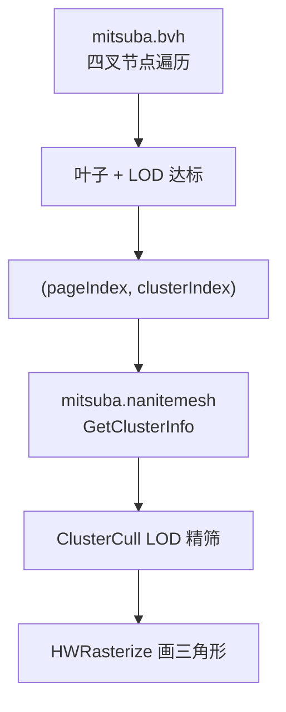

# Nanite 数据结构参考

> **用途**：查表、对照代码、理解 BVH / NaniteMesh / 运行时 SSBO 的字段含义。  
> **阅读顺序**：先扫 §1 易混对照 → 按需查 §2–§4 → 跟案例走一遍 §5。  
> **叙事导读**（Pass 怎么串起来）见 [Code_Reading_Guide.md §4](./Code_Reading_Guide.md#4-gpu-缓冲与-pass-数据流)。  
> **图示**：`doc/figures/BVH_NaniteMesh/00_overview.svg`（总览），`01`–`07` 为分步结构图。

---

## 1. 三层分类总览

Nanite 相关数据按 **存储介质** 分为三层，读代码时不要混在同一层理解：

```
┌─────────────────────────────────────────────────────────────────────────┐
│ 第 1 层：磁盘文件（离线编码，运行时 load 进 GPU）                        │
│   mitsuba.bvh          — 层次 LOD 裁剪树（四叉 BVH）                     │
│   mitsuba.nanitemesh   — 分页几何流（Page → Cluster → 顶点/索引）        │
├─────────────────────────────────────────────────────────────────────────┤
│ 第 2 层：GPU SSBO（运行时缓冲，scene.cpp Init 创建）                     │
│   sBVH / sNaniteMesh / sWorkArgs / sBatches / sVisiableClusterSWHW …   │
├─────────────────────────────────────────────────────────────────────────┤
│ 第 3 层：Shader 解包后的逻辑结构（仅存在于 GLSL 局部变量）               │
│   FHierarchyNodeSlice / ClusterInfo / (pageIndex, clusterIndex) 键     │
└─────────────────────────────────────────────────────────────────────────┘
```

### 1.1 易混对照：「4」出现在哪？

| 概念 | 固定是 4？ | 说明 |
|------|:----------:|------|
| 每 BVH 节点的子槽位 | **是** | `NANITE_MAX_BVH_NODE_FANOUT = 4` |
| 每 Page 内 Cluster 个数 | **否** | `mData[pageBase]`，每页不同 |
| 每 BVH 叶子下 Cluster 个数 | **否** | `slice.NumChildren`，最多约 511 |
| Pass 2 Ping-Pong 次数 | **是（本项目）** | `for (i=0; i<4; i++)` 写死的 BVH 层数上限 |

### 1.2 两套文件各管什么

```
┌─────────────────────────────────────────────────────────────────────────┐
│  mitsuba.bvh  (sBVH)              mitsuba.nanitemesh  (sNaniteMesh)    │
│  ─────────────────                ─────────────────────────────         │
│  「哪一片区域够细了？」            「这片区域的真实三角形在哪？」          │
│  四叉 BVH 节点 + 包围球            Page → Cluster → 顶点/索引           │
│  Pass 2 遍历                       Pass 3/4 按地址读取                   │
└─────────────────────────────────────────────────────────────────────────┘
                              │
                    叶子写出 (pageIndex, clusterIndex)
                              ▼
                    Batches[1024+] 候选列表
```

| 文件 / SSBO | 存什么 | 谁读 | 输出 |
|-------------|--------|------|------|
| `mitsuba.bvh` → `sBVH` | 层次包围盒树（LOD 裁剪） | `NodeAndClusterCull.glsl` | `(pageIndex, clusterIndex)` 候选列表 |
| `mitsuba.nanitemesh` → `sNaniteMesh` | 分页几何二进制流 | `ClusterCull` / `HWRasterizeVS` | 包围球、LOD、顶点 |

---

## 2. BVH（`mitsuba.bvh` / `sBVH`）

### 2.1 GPU 上的打包节点

每个 **BVH 节点**在 GPU 里是 `FPackedHierarchyNode`：固定 **4 个子槽位**（四叉树），每个子槽位一套 `LODBounds / Misc0 / Misc1 / Misc2`。

```
                        BVH 节点 #5（示意）
              ┌───────────┬───────────┬───────────┬───────────┐
  子槽位 j=    │  child 0  │  child 1  │  child 2  │  child 3  │  ← for(j=0; j<4; j++)
              ├───────────┼───────────┼───────────┼───────────┤
  类型         │  非叶     │  非叶     │  叶子     │  (空)     │
  含义         │ 子节点#12 │ 子节点#48 │ 挂着一批  │  bEnabled=0
              │           │           │ Cluster   │
              └───────────┴───────────┴───────────┴───────────┘
                                              │
                              ChildStartReference 打包 page + 页内 cluster 起始
                              NumChildren = 本叶子下有几个 Cluster（可 >4）
```

**代码位置**：`Res/Shaders/NodeAndClusterCull.glsl` — `struct FPackedHierarchyNode`、`UnpackHierarchyNodeSlice`。

> **图示**：`doc/figures/BVH_NaniteMesh/01`–`03`（BVH 节点与子槽位）。

### 2.2 解包后字段表（`FHierarchyNodeSlice`）

| 字段 | 类型 | 非叶节点含义 | 叶子节点含义 | 解包来源 |
|------|------|-------------|-------------|----------|
| `LODBounds` | `vec4` | 包围球 xyz + 半径 | 同左 | `LODBounds[j]` |
| `BoxBoundsCenter` | `vec3` | AABB 中心 | 同左 | `Misc0[j].xyz` |
| `BoxBoundsExtent` | `vec3` | AABB 半长 | 同左 | `Misc1[j].xyz` |
| `MinLODError` | `float` | 本节点 LOD 误差 | 同左 | `unpackHalf2x16(Misc0[j].w).x` |
| `MaxParentLODError` | `float` | 父级 LOD 误差上界 | 同左 | `unpackHalf2x16(Misc0[j].w).y` |
| `ChildStartReference` | `uint` | **子 BVH 节点 ID**（入队下一层） | **打包的 (pageIndex, 页内起始 clusterIndex)** | `Misc1[j].w` |
| `NumChildren` | `uint` | 子树 cluster 元数据 | **本叶子展开写出几个 Cluster** | `Misc2[j]` 低 9 bit |
| `StartPageIndex` | `uint` | 页索引相关 | 同左 | `Misc2[j]` 高位域 |
| `bLeaf` | `bool` | `false` | `true` | `Misc2[j] != 0xFFFFFFFF` |
| `bEnabled` | `bool` | 子槽位是否有效 | 同左 | `Misc2[j] != 0` |

### 2.3 叶子节点的 `ChildStartReference` 位域

```
ChildStartReference（32 bit，BVH 叶子用于寻址 NaniteMesh）
┌────────────────────────┬─────────────┐
│ pageIndex (高 24 bit)  │ 页内起始    │
│      >> 8              │ cluster &FF │
└────────────────────────┴─────────────┘
         │                        │
         └─ 同一叶子多簇时 page 相同 ─┘ clusterIndex 从起始 +0,+1,+2…
```

同一叶子若 `NumChildren=2`，Pass 2 会写出 `(page, start+0)` 与 `(page, start+1)` 两条候选。

**代码位置**：`NodeAndClusterCull.glsl` 叶子展开逻辑；`HWRasterizeVS.glsl` Payload 打包注释（同款 8 位语义）。

---

## 3. NaniteMesh（`mitsuba.nanitemesh` / `sNaniteMesh`）

`NaniteMesh.mData[]` 是 **`uint` 数组**（每元素 4 字节）。文件中许多偏移以 **字节** 存储，访问 `mData[i]` 前需 **`/ 4`** 换成下标。

> **图示**：`doc/figures/BVH_NaniteMesh/04`–`07`（页目录、Page 头、Cluster 头）。

### 3.1 层级 1 — 全局页目录（文件开头）

```
mData 下标    字节地址    内容
────────────────────────────────────────────
[0]           0          pageCount = 2（共 2 页）
[1]           4          Page0 起始字节偏移 = 32
[2]           8          Page1 起始字节偏移 = 4096
```

```glsl
pageBaseOffsetInBytes = NaniteMesh.mData[1 + inPageIndex];
pageBaseOffset        = pageBaseOffsetInBytes / 4;
```

### 3.2 层级 2 — 单页页头 + 数据区

页头 = **1 个 cluster 个数 + N 项偏移表**（每项 1 个 `uint`，存字节偏移）。

```
假设 pageBase=8（=32字节/4），本页 clusterCountOnPage=3

下标          内容                          说明
──────────────────────────────────────────────────────────────
[8]           3                             页头·个数（1 个 uint）
[9]           0                             表[0]：cluster0 在数据区内字节 0
[10]          512                           表[1]：cluster1 在数据区内字节 512
[11]          1024                          表[2]：cluster2 在数据区内字节 1024
──────────── 页头结束，共 1+3=4 个 uint ─────────────────────
[12] ...      Cluster0 的头 + 顶点/索引…    数据区起点 = pageBase+1+clusterCount
```

```glsl
clusterCountOnPage       = NaniteMesh.mData[pageBase];
clusterBaseOffsetInBytes = NaniteMesh.mData[pageBase + 1 + clusterIndex];
clusterBaseOffset        = pageBase + 1 + clusterCountOnPage + clusterBaseOffsetInBytes / 4;
```

### 3.3 层级 3 — 单个 Cluster 头

| 偏移（相对 `clusterBase`） | 字段 | 含义 |
|:--:|------|------|
| +0 | 索引区字节偏移 | `/4` → `mIndexOffset` |
| +1 | `mIndexCount` | 索引个数（常为 384 = 128 三角 × 3） |
| +2..+5 | 包围球 xyz + 半径 | `uint` 位型 `float` |
| +6 | `mLODError`, `mEdgeLength` | `unpackHalf2x16` |
| +7.. | 索引流、顶点 `float3` | `HWRasterizeVS` 取顶点用 |

**代码位置**：`Res/Shaders/ClusterCull.glsl`、`HWRasterizeVS.glsl` — `GetClusterInfo()`。

### 3.4 Shader 内逻辑结构（`ClusterInfo`）

```glsl
struct ClusterInfo {
    uint  mBaseOffset;       // Cluster 头在 NaniteMesh.mData 的 uint 下标
    uint  mIndexOffset;      // 索引表起点（相对 cluster 头）
    uint  mIndexCount;
    vec3  mBoxBoundsCenter;
    float mLODError;
    float mEdgeLength;
};
```

---

## 4. 运行时中间缓冲（SSBO）

除 BVH / NaniteMesh 外，管线在 Pass 之间还经过以下缓冲（详见 [Code_Reading_Guide §4.2–4.4](./Code_Reading_Guide.md#4-gpu-缓冲与-pass-数据流)）。

### 4.1 `sMainAndPostNodeAndClusterBatches`

| 区域 | 下标范围 | 内容 |
|------|----------|------|
| 节点栈 | `[0 .. 1023]` | 待遍历的 BVH 节点 ID（Pass 2 每层 Ping-Pong 写入） |
| Cluster 候选列表 | `[1024 ..]` | 交错：`[pageIndex, clusterIndex, ...]` |

### 4.2 `sVisiableClusterSWHW`

Pass 3 输出的 **最终可见** Cluster 列表，格式与候选列表相同。  
`HWRasterizeVS` 用 `gl_InstanceID` 索引：`mData[instance*2]` = page，`mData[instance*2+1]` = cluster。

### 4.3 `sVisBuffer64`

每像素一个 `uint64_t`：

```
┌─────────────────────────────────────────────────────────────┐
│  高 32 位：float 深度（floatBitsToUint，保序）              │
│  低 32 位：Payload = (pageIndex << 8) | (clusterIndex + 1)  │
└─────────────────────────────────────────────────────────────┘
```

| 值 | 含义 |
|----|------|
| 清空值 `0xFFFFFFFF00000000` | 最远深度 + 空 payload |
| `HWRasterizeFS` `atomicMin` | 保留更近片元 |
| `Visualization` | 低 32 位 `& 0xFF` 得 `clusterIndex` 上色 |

### 4.4 数据流一览



| 阶段 | `(pageIndex, clusterIndex)` 的用法 |
|------|-----------------------------------|
| `Batches[1024+]` | Pass 2 候选列表 |
| `VisiableClusterSWHW` | Pass 3 可见列表 |
| `HWRasterizeVS` Payload | `(pageIndex<<8) \| (clusterIndex+1)` |
| `Visualization` | 低 8 位解码 cluster 上色 |

---

## 5. 完整寻址案例

**场景 A — BVH 叶子展开**  
BVH 某叶子 `NumChildren=2`，`ChildStartReference = 0x00000108`（pageIndex=1，页内起始 cluster=8）。

Pass 2 写入 `Batches[1024+]`：
```
(pageIndex=1, clusterIndex=8)
(pageIndex=1, clusterIndex=9)
```

**场景 B — `GetClusterInfo(pageIndex=0, clusterIndex=1)`**

| 步骤 | 计算 | 结果 |
|:--:|------|------|
| 1 | `mData[1+0]` → 32 字节 → `/4` | `pageBase=8` |
| 2 | `mData[8]=3`，`mData[8+1+1]=mData[10]=512` | 页内第 1 号 cluster |
| 3 | `8+1+3+512/4` | `clusterBase=140` |
| 4 | 读 `mData[140..]` | 包围球、`mLODError` 等 |

```
(pageIndex, clusterIndex)  ≈  (第几页, 页内第几个)
        │                           │
        └──────── GetClusterInfo ───┘
                        │
                        ▼
              clusterBase 处读 Cluster 头
```

> **注意**：`(pageIndex, clusterIndex)` 必须成对使用；单独改 page 或 cluster 会读到完全错误的 Cluster。

---

## 6. 字节偏移 vs `uint` 下标

| 存储位置 | 单位 | 何时 `/4` |
|----------|------|-----------|
| `mData[i]` 的下标 `i` | **第 i 个 uint** | 已是指下标，不再除 |
| 页目录、页内偏移表、Cluster 头 `[+0]` | **字节** | 访问 `mData[?]` 前 **`/4`** |

```
字节:  0    4    8   12   16
      [u0][u1][u2][u3][u4]     ← mData[0..4]
            ↑
      字节偏移 8  →  下标 8/4 = 2  →  mData[2]
```

---

## 7. 与 UE Nanite 的差异（本 Demo）

| 项目 | UE 正式 Nanite | 本仓库 Demo |
|------|----------------|-------------|
| BVH 遍历层数 | 动态，直到队列为空 | **写死 4 层** Ping-Pong |
| ClusterCull 并行 | GPU 多线程 + atomic | **单线程 for 循环**（调试用） |
| 光栅化路径 | SW + HW 双路径 | **仅 HW**（`VisiableCluster**SWHW**` 命名预留） |
| 投影近裁剪 `ZNear` | 与 C++ 一致 | Shader `GetProjectionScales` 内 **硬编码 10.0**（与 C++ near=1.0 不一致，见 `ClusterCull.glsl` 注释） |

换更深 BVH 或并行 ClusterCull 时，见 [Code_Optimization_TODO.md](./Code_Optimization_TODO.md)。

---

## 8. 代码索引

| 主题 | 文件 |
|------|------|
| BVH 解包、`FPackedHierarchyNode` | `Res/Shaders/NodeAndClusterCull.glsl` |
| `GetClusterInfo`、LOD 筛选 | `Res/Shaders/ClusterCull.glsl` |
| 实例化绘制、Payload 打包 | `Res/Shaders/HWRasterizeVS.glsl` |
| VisBuffer `atomicMin` | `Res/Shaders/HWRasterizeFS.glsl` |
| SSBO 创建与绑定 | `src/Scene/scene.cpp` `Init()` |
| 离线编码参考（不参与 exe 编译） | `Res/Tools/NaniteEncode.cpp` |

---

*文档与代码不一致时以代码为准。叙事版 Pass 串联见 [Code_Reading_Guide.md](./Code_Reading_Guide.md)。*
