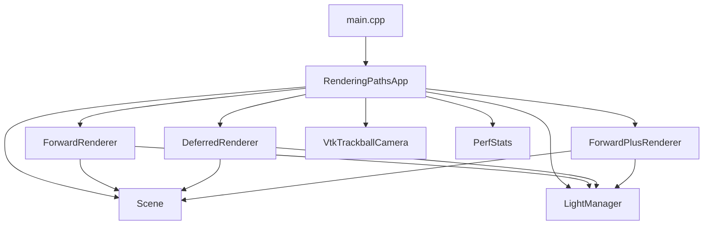
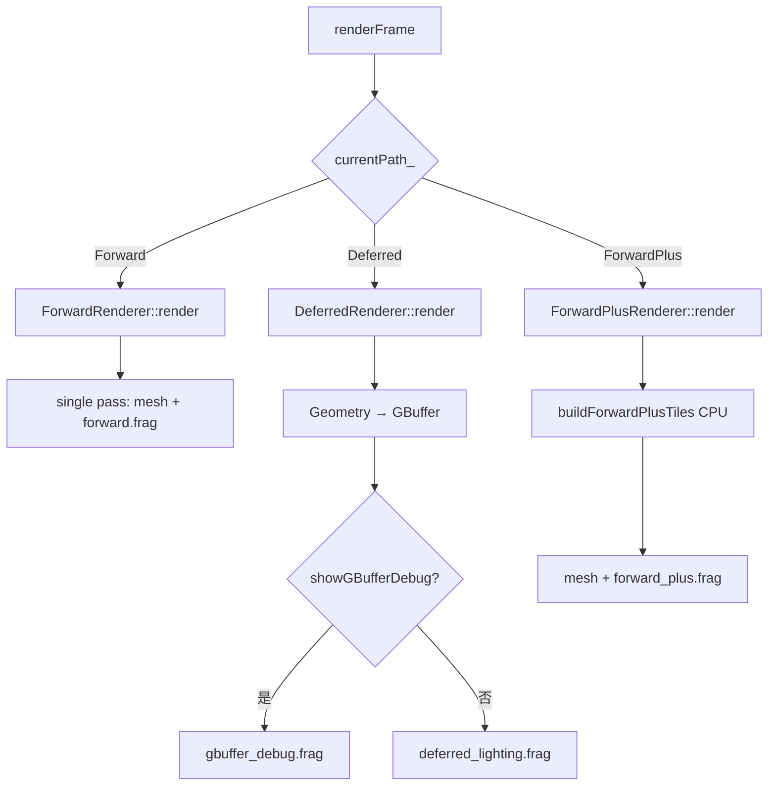

# OpenGL Rendering Paths

> 源码：[GitHub — OpenGL_Rendering_Paths](https://github.com/HalCG/OpenGLInstance/tree/main/OpenGL_Rendering_Paths)  
> 仓库根：[HalCG/OpenGLInstance](https://github.com/HalCG/OpenGLInstance)  
> 配套：[`Rendering_Paths_代码导读.md`](Rendering_Paths_代码导读.md)（零基础概念、模块地图、阅读路线）  
> **RenderDoc 问题记录：** [`RenderDoc_问题记录.md`](RenderDoc_问题记录.md)

---

## 1. 这篇博客讲什么

`OpenGL_Rendering_Paths` 是一个 **运行时切换** 的对比 Demo：同一场景、同一套点光源、同一套 Blinn-Phong 光照公式，分别用 **Forward / Deferred / Forward+** 三条路径渲染，用窗口标题和控制台 CSV 看各 Pass 耗时差异。

本文**不**赘述窗口、CMake、资源部署等工程细节，重点放在：

- 三条路径的 **数据流与 Pass 划分**
- 应用层 **关键状态** 如何驱动切换与重绘
- **LightManager** 如何造灯、如何做 Forward+ tile 分配
- **Deferred** 两阶段管线与光照 shader 在算什么
- 学习过程中常见疑问的 **整合解答**（随机分布、彩虹色、AABB 角点、tile 登记、半程向量等）

---

## 2. 场景与「公平对比」的设计

**场景：** 12 个 spot 实例 + 地板；默认 **256 盏点光源**（`[` / `]` 在 64 / 128 / 256 / 512 间切换）。

**公平性：** 三条路径共用

- 同一 `Scene`（网格与实例变换）
- 同一 `LightManager`（SSBO 点光源布局）
- 同一套光照数学（ambient + Lambert 漫反射 + Blinn-Phong 高光 + 半径衰减）

区别只在 **「什么时候、在哪里、对多少盏灯做循环」**。

---

## 3. 应用层：关键状态与切换作用

主控在 `RenderingPathsApp`，一帧的生命周期可以概括为：

```
输入/相机变化 → markCameraDirty()
     ↓
renderFrame() 按 currentPath_ 分发
     ↓
对应 Renderer 写屏 + PerfStats 计时
     ↓
swapBuffers；cameraDirty_ = false
```

### 3.1 核心状态变量

| 状态 | 类型 | 作用 |
|------|------|------|
| `currentPath_` | `Forward / Deferred / ForwardPlus` | **决定走哪条渲染管线**；`renderFrame()` 的 `switch` 唯一分支依据 |
| `cameraDirty_` | `bool` | **是否需要渲染一帧**；事件驱动：静止时 `glfwWaitEvents` 阻塞，有输入才 poll + draw |
| `showGBufferDebug_` | `bool` | **仅 Deferred 有效**；为 true 时跳过 lighting pass，全屏显示 GBuffer（albedo 等） |
| `lightPresetIndex_` | `int` | 当前光源数量档位；`[`/`]` 改变后调用 `lights_.regenerate(...)` **重建 SSBO 数据** |
| `camera_.isDragging()` | 来自轨道球相机 | 拖拽时 **关闭 GPU timer**、降低标题刷新频率，减少测量开销造成的卡顿感 |

### 3.2 按键与状态切换

| 按键 | 修改的状态 | 实际效果 |
|------|------------|----------|
| `1` / `F1` | `currentPath_ = Forward` | 单 Pass 前向；`showGBufferDebug_ = false` |
| `2` / `F2` | `currentPath_ = Deferred` | Geometry + Lighting 两 Pass |
| `3` / `F3` | `currentPath_ = ForwardPlus` | CPU tile cull + 前向 shading |
| `[` / `]` | `lightPresetIndex_` → `regenerate` | **三路径同时** 改变循环上限；`markCameraDirty()` |
| `G` | `showGBufferDebug_` 翻转 | **仅 Deferred**；Debug 时 `light_ms` 为 0 |
| 鼠标/滚轮 | 相机 yaw/pitch/radius | `cameraDirty_ = true`，触发重绘 |

**为什么 `cameraDirty_` 重要：** 这不是 VSync 下的每帧游戏循环，而是 **按需渲染**。理解性能对比时要知道：静止画面 CPU/GPU 几乎休眠；一动相机才出帧。CSV 每 120 帧在 **有渲染的帧** 上采样。

**为什么路径切换要 `markCameraDirty()`：** 切换后即使相机不动，也必须 **立刻重画一帧**，否则画面仍停留在上一路径的结果。

---

## 4. 光源系统：LightManager 在做什么

### 4.1 点光源 GPU 布局

```cpp
struct GpuPointLight {
    glm::vec4 positionRadius;  // xyz = 位置, w = 影响半径 (3.5)
    glm::vec4 colorIntensity;  // rgb = 颜色, w = 强度
};
```

三路径的 fragment shader 都从 **binding=0 的 SSBO** 读同一数组。

### 4.2 `regenerate()`：随机分布与「彩虹色」

`LightManager::regenerate()` 用固定种子 `mt19937(1337)`，保证每次按 `[`/`]` 换档位时 **布局可复现**，便于对比路径而非对比随机场景。

**`std::uniform_real_distribution` 的特点：**

- 在 `[a, b)` 上 **均匀** 抽样（上界通常取不到）
- 必须配合 `mt19937` 等引擎使用
- 固定种子 → 可复现的 Demo 灯光布局

各分布用途：

| 分布 | 范围 | 用途 |
|------|------|------|
| `posX`, `posZ` | -4 ~ 4 | 光源在 spot 周围水平散布 |
| `posY` | 0.5 ~ 3.5 | 高度，避免贴地 |
| `hue` | 0 ~ 1 | 生成不同色相 |
| `intensity` | 0.6 ~ 1.4 | 光强 |

**彩虹色一行代码在做什么：**

```cpp
const glm::vec3 color = glm::abs(glm::vec3(h * 6.0f + 0.0f, h * 6.0f + 2.0f, h * 6.0f + 4.0f) - glm::vec3(3.0f));
```

这不是标准 HSV→RGB，而是用 **三条相位错开的折线** 从单个 `h` 快速生成饱和、彼此差异大的 RGB：

- R = `abs(h*6 - 3)`，G = `abs(h*6 - 1)`，B = `abs(h*6 + 1)`
- 一个随机数 → 一盏灯一种颜色；值可能 > 1，配合 `intensity` 当偏亮灯色使用

超出 `activeCount_` 的槽位清零，shader 里仍用 `uLightCount` 限制循环次数。

---

## 5. 三条路径：流程与瓶颈

### 5.1 Forward — 最直白的「物体 × 光源」

```
bind 默认 FBO → clear
upload Light SSBO
对每个 mesh 实例：
  forward.frag：每个 fragment 循环 uLightCount 盏灯
```

- **Pass 数：** 1
- **计时：** `forward_ms`
- **瓶颈：** fragment 内 `for (i < uLightCount)`；256 光 × 12 实例时 **最重**
- **文件：** `ForwardRenderer.cpp` + `forward.frag`

光照循环与另外两条路径 **公式相同**（见第 7 节）。

---

### 5.2 Deferred — 几何与光照解耦

#### 总流程

```
Pass 1 Geometry  →  GBuffer FBO（不写最终色）
Pass 2 Lighting  →  默认 FBO（全屏 quad）
```

或 Debug 分支：`G` → 只显示 GBuffer，**跳过 Pass 2**。

#### 着色器分工与初始化 (`DeferredRenderer::init`)

延迟渲染初始化时需要准备 3 个核心着色器：
- **`geometryShader_` (`mesh.vert` + `geometry.frag`)**：几何阶段使用，绘制 3D 几何体，不计算光照，仅将表面属性（Albedo、Normal、Material）填充至 GBuffer。
- **`lightingShader_` (`fullscreen.vert` + `deferred_lighting.frag`)**：光照阶段使用，绘制全屏 Quad，读取 GBuffer 贴图集中进行像素级光照计算。
- **`debugShader_` (`fullscreen.vert` + `gbuffer_debug.frag`)**：调试阶段使用，用于在按下 `G` 键时直接把 GBuffer 各个附件可视化展示在屏幕上。

#### GBuffer 布局与数据类型选型依据

延迟渲染最大的性能瓶颈在于**显存带宽（Bandwidth）**，格式选择的核心原则是：**“满足精度前提下极力节省带宽”**。

| 附件 | 格式 | 内容 | 格式选型依据 |
|------|------|------|-------------|
| **RT0** | `RGBA8` | Albedo（贴图颜色） | 8-bit/通道满足 LDR 颜色精度（256阶），极大节省读写带宽。 |
| **RT1** | `RGB16F` | 世界空间法线 | 16-bit 半精度浮点，防止高光/漫反射出现色彩断层（Banding）；支持原生负数区间 `[-1, 1]`，省去编码/解码开销。 |
| **RT2** | `RGBA8` | Material：`(Ka, Kd, Ks)` | 环境光/漫反射/高光系数或 Roughness/Metallic 都在 `[0, 1]` 内，8-bit 精度足够且支持通道打包复用。 |
| **Depth** | `D32F` | 深度（**不存 worldPos，靠深度反推**） | 32-bit 浮点深度。**不单独开 `gPosition` 附件**以大省带宽；通过高精度 Depth + 逆 MVP 矩阵重构世界坐标。 |

Geometry Pass（`geometry.frag`）只做：

```glsl
gAlbedo = texture(...);
gNormal = normalize(vNormal);
gMaterial = vec4(0.15, 0.75, 0.35, 1.0);
```

Lighting Pass（`deferred_lighting.frag`）对每个屏幕像素：

1. 采样 albedo / normal / material / depth
2. **`reconstructWorldPos(uv, depth)`** — 逆投影 + 逆视图
3. 循环全部点光源累加颜色
4. **HDR Tone Mapping & Gamma 校正**（可通过按键 `H` 开关控制 `uEnableHDR`）：使用 Reinhard 算法 `result / (result + 1.0)` 将多光源累加结果平滑压缩至 `[0, 1]` 范围，防止高光死白过曝，并做 Gamma 2.2 空间转换。
5. **`glDisable(GL_DEPTH_TEST)`** — 全屏 quad 不依赖 raster depth，深度只存在于纹理


#### 多渲染目标 MRT 机制 (`glDrawBuffers`)

在创建 GBuffer FBO 时，必须显式告知 OpenGL 开启多渲染目标：

```cpp
const GLenum attachments[] = {GL_COLOR_ATTACHMENT0, GL_COLOR_ATTACHMENT1, GL_COLOR_ATTACHMENT2};
glDrawBuffers(3, attachments);
```

- **绑定映射**：`attachments` 数组的下标索引与 `geometry.frag` 中的 `layout(location = N)` 输出形成一对一映射（如 `location = 1` 对应 `attachments[1]` 即 `GL_COLOR_ATTACHMENT1`）。
- **必要性**：OpenGL 自定义帧缓冲区默认只激活 `COLOR_ATTACHMENT0`。如果不显式调用 `glDrawBuffers` 激活后两个附件，写入 `location = 1` 和 `2` 的法线与材质数据将被 OpenGL 忽略丢弃。

#### 为什么 Deferred 的 `light_ms` 随光源数涨、而 `geom_ms` 较稳？

- Geometry：与 **物体数** 相关，与 **光源数无关**
- Lighting：全屏像素 × **每像素 uLightCount 次循环** — 本 Demo **没有** tile/cluster 光剔

#### `G` 调试态的意义

`showGBufferDebug_ == true` 时验证 Pass 1 是否正确：法线、albedo 异常时，Lighting 必然全错。此时应 **先修 Geometry**，再查 lighting。


---

### 5.3 Forward+ — 前向 + 按 tile 减光源

#### 总流程

```
Phase 0  CPU: buildForwardPlusTiles()  →  TileCounts + TileIndices SSBO
Phase 1  GPU: forward_plus.frag       →  每 fragment 只循环本 tile 的灯
```

#### Tile 参数

- Tile 大小：**16×16** 像素
- 每 tile 最多 **64** 盏灯（`kMaxLightsPerTile`）
- SSBO：`LightBuffer`(0) + `TileCounts`(1) + `TileIndices`(2)

#### Shader 侧

```glsl
ivec2 tile = ivec2(gl_FragCoord.xy) / uTileSize;
int tileIndex = tile.y * uTilesX + tile.x;
uint localCount = counts[tileIndex];
for (uint i = 0u; i < localCount; ++i) {
    uint lightIndex = indices[tileIndex * uMaxLightsPerTile + int(i)];
    // 用 lights[lightIndex] 做与 forward 相同的光照
}
```

**关键：** 仍是 **画 mesh 时算光**（前向），但循环次数从 256 降到「该 tile 候选列表长度」。

---

## 6. Forward+ 光分配：CPU 侧两段关键代码

### 6.1 八个角点：包住点光源的 AABB

对每盏灯，取球心 `center` 与半径 `radius`，三重循环 `x,y,z ∈ {0,1}`：

```cpp
const glm::vec3 offset((x ? 1.0f : -1.0f) * radius, ...);
corners[...] = center + offset;
```

得到 **8 个角点**，即 `[center ± radius]` 的轴对齐包围盒，近似包住点光影响球（略保守，安全不漏灯）。

8 个角点投影到屏幕 → 像素矩形 `[minX,maxX]×[minY,maxY]`。

### 6.2 像素矩形 → tile 登记

```cpp
tileMinX = (int)minX / kTileSize;
tileMaxX = (int)maxX / kTileSize;
// tileMinY / tileMaxY 同理

for (ty = tileMinY; ty <= tileMaxY)
  for (tx = tileMinX; tx <= tileMaxX) {
    tileIndex = ty * tilesX + tx;
    indices[tileIndex * 64 + count++] = lightId;
  }
```

含义：**把这盏灯登记到其屏幕投影覆盖的所有 tile**。

`counts[tileIndex]` 记录该 tile 有几盏候选灯；满 64 则丢弃（防止 SSBO 溢出）。

Forward+ 的 **`cull_ms`** 主要就是这段 CPU 工作；**`shade_ms`** 通常低于 Forward 的 **`forward_ms`**，因为 fragment 循环变短。

---

## 7. 光照公式：三路径共用的一盏灯

以下在 `forward.frag`、`deferred_lighting.frag`、`forward_plus.frag` 中 **同构**（Deferred 从 GBuffer 取 `normal/albedo/materialK/worldPos`）。

### 7.1 读灯与 early-out

```glsl
vec3 lightDir = lightPos - worldPos;
float dist = length(lightDir);
if (dist > radius) continue;
lightDir = normalize(lightDir);
```

超出影响半径 **不算这盏灯**。

### 7.2 距离衰减

```glsl
float attenuation = 1.0 - smoothstep(radius * 0.7, radius, dist);
```

在 `0.7×radius ~ radius` 之间从 1 平滑降到 0，软边界，非物理精确反比平方。

### 7.3 漫反射（Lambert）

```glsl
vec3 diffuse = Kd * max(dot(normal, lightDir), 0.0) * lightColor * albedo;
```

- `dot(N, L)`：表面朝向光的程度
- `max(..., 0)`：背光不贡献
- 乘 `albedo`：贴图底色

### 7.4 镜面高光（Blinn-Phong）与半程向量

```glsl
vec3 halfway = normalize(lightDir + viewDir);  // H = normalize(L + V)
vec3 specular = Ks * pow(max(dot(normal, halfway), 0.0), 32.0) * lightColor;
result += (diffuse + specular) * attenuation;
```

**半程向量 H 是什么？**

- **L**：表面 → 光源（`lightDir`）
- **V**：表面 → 相机（`viewDir`）
- **H**：L 与 V 的 **角平分线方向**

**为什么用 N·H 而不是 Phong 的 R·V？**

| | Phong | Blinn-Phong（本 Demo） |
|--|-------|------------------------|
| 高光度量 | 反射方向 R 与 V 的夹角 | 法线 N 与半程 H 的夹角 |
| 计算 | 需 `reflect()` | 只需 `normalize(L+V)`，更快 |
| 形状 | 经典尖峰 | 略宽，实时里更常见 |

**几何直觉：** 当宏观法线 N 接近 H 时，越多微平面能把来自 L 的光反射进 V → 高光最强。

`pow(N·H, 32)` 把贡献压成 **小亮斑**；32 越大高光越锐。

**与 diffuse 的分工：**

- **N·L** → 宽缓的「被照亮」
- **N·H** → 集中的「镜面闪点」
- 两者加在一起再乘 **attenuation**，累加到 `Ka * albedo` 的环境项上

Deferred 里 `worldPos` 来自 depth 反推，因此 **L、V、H 与 Forward 几何一致**，对比才公平。

---

## 8. 三路径对照：一张表收束

| 维度 | Forward | Deferred | Forward+ |
|------|---------|----------|----------|
| Pass | 1 | 2（+ 可选 Debug） | Cull + Shading |
| 何时算光 | 画物体 | 全屏 | 画物体 |
| 每像素灯循环 | 全部 `uLightCount` | 全部 `uLightCount` | 仅 tile 内列表 |
| 表面数据 | varying | GBuffer 纹理 | varying |
| 世界坐标 | `vWorldPos` | depth 重建 | `vWorldPos` |
| 主要耗时字段 | `forward_ms` | `geom_ms` + `light_ms` | `cull_ms` + `shade_ms` |
| 256 光拖拽体感 | 往往最顿 | lighting 重 | 通常最跟手 |

**预期实验：**

1. 固定 256 光，拖相机对比三路径标题栏 ms
2. `[` 降到 64，看 Forward 是否明显好转
3. Deferred 按 `G` 看 GBuffer，再关 Debug 看 lighting
4. Forward+ 拉近/拉远，观察 `cull_ms` 几乎不变、`shade_ms` 随场景略变

控制台 CSV 示例：

```
path,Forward,lights,256,...,forward_ms,14.3,...
path,Deferred,lights,256,...,geom_ms,3.2,light_ms,18.9,...
path,ForwardPlus,lights,256,...,cull_ms,0.4,shade_ms,12.1,...
```

---

## 9. 读代码推荐顺序

1. `RenderingPathsApp::renderFrame` — 三分支 dispatch
2. `LightManager::regenerate` + `buildForwardPlusTiles` — 灯从哪来、Forward+ 数据从哪来
3. `ForwardRenderer` — 基线
4. `DeferredRenderer::render` + `deferred_lighting.frag` — 两 Pass + 重建位置
5. `ForwardPlusRenderer` + `forward_plus.frag` — tile 索引如何消费
6. 三份 frag 的 **for 循环** 并排对比 — 理解「公式相同、循环范围不同」

更细的模块地图见 [`Rendering_Paths_代码导读.md`](Rendering_Paths_代码导读.md)。

---

## 10. 与仓库其它 Demo 的关系

- **透明 / OIT：** Deferred 不能直接处理透明；见 [OpenGL_OIT_*](https://github.com/HalCG/OpenGLInstance/tree/main)
- **PBR：** 本 Demo 是 LDR Blinn-Phong；物理材质见 [OpenGL_PBR](https://github.com/HalCG/OpenGLInstance/tree/main/OpenGL_PBR)
- **抗锯齿：** MSAA 对 Forward/Forward+ 友好，对 Deferred GBuffer 困难；见 [OpenGL_Anti_Aliasing](https://github.com/HalCG/OpenGLInstance/tree/main/OpenGL_Anti_Aliasing)

---

## 附录 A：Deferred 单像素数据流

```
Geometry Pass:
  mesh → geometry.frag → RT0 albedo, RT1 normal, RT2 material, depth

Lighting Pass:
  fullscreen → 读 GBuffer
            → reconstructWorldPos(depth)
            → for each light: diffuse + specular(Blinn-Phong)
            → FragColor
```

---

## 附录 B：Forward+ 单盏灯登记

```
center, radius
  → 8 个 AABB 角点
  → 投影得屏幕矩形
  → 换算 tileMin..tileMax
  → 写入 counts[] / indices[]
  → GPU: fragment 只读自己 tile 的 indices
```

---

## 附录 C：源码索引

```
OpenGL_Rendering_Paths/
  src/RenderingPathsApp.cpp   # 主循环、输入、路径切换
  src/ForwardRenderer.cpp
  src/DeferredRenderer.cpp
  src/ForwardPlusRenderer.cpp
  src/LightManager.cpp        # 点光源 + Forward+ tile culling
  src/Scene.cpp
  resources/shaders/
    forward.frag
    geometry.frag
    deferred_lighting.frag
    forward_plus.frag
```

GitHub 目录：[https://github.com/HalCG/OpenGLInstance/tree/main/OpenGL_Rendering_Paths](https://github.com/HalCG/OpenGLInstance/tree/main/OpenGL_Rendering_Paths)

---

## 附录 D：三种渲染路径综合对比（原理、优缺点与特性）

### D.1 算法复杂度与数据流概览

| 渲染路径 | 渲染流程 | 算法复杂度 | 关键优势 |
| :--- | :--- | :--- | :--- |
| **Forward** | 对每个物体绘制时，在 Fragment Shader 中循环**所有光源**计算颜色 | $\mathcal{O}(\text{物体数} \times \text{像素数} \times \text{光源数})$ | 结构简单、半透明与 MSAA 原生支持、显存带宽低 |
| **Deferred** | **Pass 1**：几何属性写入 G-Buffer (不计光)<br>**Pass 2**：全屏按像素读取 G-Buffer 统一算光 | $\mathcal{O}(\text{几何光栅化}) + \mathcal{O}(\text{屏幕像素} \times \text{光源数})$ | 光照与几何复杂度完全解耦、零 Overdraw 废像素光照 |
| **Forward+** | **Pass 0**：屏幕划分 16x16 Tile 并做光源剔除<br>**Pass 1**：前向绘制，但仅循环**当前 Tile 内的少量光源** | $\mathcal{O}(\text{物体数} \times \text{像素数} \times \text{Tile光源数})$<br>其中 $\text{Tile光源数} \ll \text{总光源数}$ | 兼具 Forward 优势（透明/MSAA/多材质）与多光源高效率 |

### D.2 核心特性与优缺点对比表

| 比较维度 | Forward (前向渲染) | Deferred (延迟渲染) | Forward+ (Tiled Forward) |
| :--- | :--- | :--- | :--- |
| **多光源 (数百~上千)** | ❌ **极差**（Shader `for` 循环开销爆炸） | ✅ **极佳**（与几何复杂度彻底解耦） | ✅ **优秀**（Tile 剔除大幅压短循环） |
| **半透明 (Alpha Blend)** | ✅ **原生完美支持** (按顺序 Blend 绘制) | ❌ **无法直接处理** (需要混合 Forward Pass) | ✅ **原生完美支持** |
| **硬件 MSAA 抗锯齿** | ✅ **原生支持** (直接开启 OpenGL MSAA) | ❌ **难以直接支持** (需用 FXAA/TAA 后处理) | ✅ **原生支持** |
| **显存带宽 (VRAM)** | ✅ **极低** (仅写屏幕 Framebuffer) | ❌ **极高** (读写多张高分辨率 G-Buffer 纹理) | ✅ **较低** (不依赖大 G-Buffer) |
| **Overdraw 废像素开销** | ❌ **高** (被遮挡的片元仍多次计算光照) | ✅ **无** (深度测试过滤后，只对最前片元算光) | ⚠️ **中等** (受深度遮挡影响) |
| **材质多样性** | ✅ **极其灵活** (每个 Mesh 自由定制 Shader) | ⚠️ **受限** (需在统一 Lighting Pass 处理) | ✅ **极其灵活** |
| **典型适用场景** | 移动端轻量 Demo、光源少、场景简单 | 3A 大作、PC/主机、复杂多光源场景 | 大量光源 + 透明物体 + 多材质复杂场景 |

---

## 附录 E：交互、性能与观察

### 拖拽卡顿：算法负载 vs 实现开销

| 路径 | 默认 256 光源下拖拽 | 建议对比方式 |
|------|---------------------|--------------|
| **Forward** | GPU 最重（每像素循环 256 盏光 × 12 实例），帧时间波动大 | 按 `3` 切 Forward+，或按 `[` 降到 64/128 |
| **Deferred** | geometry pass 稳定，lighting pass 随光源数增加 | 与 Forward 对比 `light_ms` |
| **Forward+** | 通常最跟手（tile 内光源远少于总数） | 作为多光源前向的参考体验 |

本项目已做交互优化：先 `pollEvents` 再 render、拖拽期间跳过 GPU timer 与窗口标题更新。Forward + 256 lights 在 VSync 下仍可能比 Forward+ 慢，这属于 **渲染路径特性**，不是 bug。

### 性能展示

- **窗口标题**：当前路径、FPS、帧时间、各 Pass GPU 耗时
- **控制台 CSV**（每 120 帧）：便于记录对比数据

### 预期现象

- **Forward**：光源从 64 → 512 时，`forward_ms` 明显陡增
- **Deferred**：`geom_ms` 较稳定，`light_ms` 随光源增加
- **Forward+**：`shade_ms` 增长慢于 Forward（tile 内光源远少于总数）

### 构建与运行（简）

```bash
cmake --preset x64-clang-debug
cmake --build out/build/x64-clang-debug --target OpenGL_Rendering_Paths
```

可执行文件：`out/build/x64-clang-debug/OpenGL_Rendering_Paths/OpenGL_Rendering_Paths.exe`（需在 exe 同目录运行，`resources/` 由 CMake 部署）。

---

## 附录 F：注意事项与常见坑

### Forward

- 多光源时 fragment 循环是瓶颈；SSBO 大小限制最大光源数（本项目 512）
- 动态分支 `if (dist > radius)` 在 GPU 上仍有开销

### Deferred

- **透明物体**不能直接写入标准 G-Buffer，需单独 forward pass（见 OIT 子项目）
- G-Buffer 格式与带宽：RT 越多、精度越高，fill-rate 压力越大
- 深度重建依赖 `inverse(view/proj)`，精度不足会出现光照接缝
- MSAA 与 deferred 结合困难（需 per-sample G-Buffer 或 edge AA）

### Forward+

- Tile 大小权衡：过小 → culling 开销大；过大 → tile 内光源仍多
- `kMaxLightsPerTile` 过小会丢光；过大浪费 SSBO 与循环
- 首版用 **CPU culling**；生产环境常用 compute shader
- Depth pre-pass 可减少 overdraw（本 demo 未单独实现）

### 通用

- 多光源 demo 应用 **HDR + tone mapping**；本项目为 LDR 简化
- 阴影未实现；加入 shadow map 后 deferred 更易统一处理
- GPU timer query 在 profiling 时有 driver 开销；拖拽期间已自动跳过以提升跟手性

---

## 附录 G：与 OIT 子项目的关系

| 问题 | 推荐 Demo |
|------|-----------|
| 多光源 opaque 对比 | `OpenGL_Rendering_Paths`（本项目） |
| 顺序无关透明 | `OpenGL_OIT_Linked_list` / Depth Peeling / Stochastic |

Deferred 处理透明需 hybrid：opaque 走 G-Buffer，transparent 走 linked list / depth peeling 等。

GitHub：[OpenGL_OIT_Linked_list](https://github.com/HalCG/OpenGLInstance/tree/main/OpenGL_OIT_Linked_list) · [OpenGL_OIT_Depth_Peeling](https://github.com/HalCG/OpenGLInstance/tree/main/OpenGL_OIT_Depth_Peeling) · [OpenGL_OIT_Stochastic_Transparency](https://github.com/HalCG/OpenGLInstance/tree/main/OpenGL_OIT_Stochastic_Transparency)

---

## 附录 H：扩展方向（Phase 2）

- **Clustered Deferred**：3D 光源 cluster，进一步减少每像素光源数
- **Tiled Deferred**：与 Forward+ 类似的 tile 思想用于 deferred lighting
- **Compute-based Forward+**：GPU light culling，替代 CPU tile 构建
- **Hybrid Rendering**：opaque deferred + transparent forward

---


## 13. 代码导读

### 13.0 三种渲染路径从零理解

渲染路径（Rendering Path）回答的是：**给定 N 个物体、M 盏灯，GPU 按什么顺序算颜色？**

下面用「一个像素要被多少盏灯影响」来建立直觉。本 Demo 默认 **12 个 spot 实例 + 地板 + 256 盏点光源**。

#### 13.01 前向渲染（Forward）

**一句话：** 画每个物体时，**在这个物体的 fragment shader 里，对该像素循环所有光源**。

```
对每个 mesh 实例：
  对每个 fragment（像素）：
    color = 环境光
    for 每一盏点光源：
      color += 这盏光对该像素的贡献
    写入 framebuffer
```

| 优点 | 缺点 |
|------|------|
| 思路简单，透明物体自然支持 | 光源多时 **fragment 循环爆炸** |
| MSAA 友好 | 复杂度 ≈ **物体数 × 像素数 × 光源数**（本 Demo 最重） |

**本项目对应：** `ForwardRenderer` + `forward.frag`（`for (i = 0; i < uLightCount; ++i)`）。

---

#### 13.02 延迟渲染（Deferred）

**一句话：** 先 **不写最终颜色**，把每个像素的几何属性存进 **G-Buffer**；再 **全屏** 按像素读 G-Buffer，循环光源算光照。

分两趟（Pass）：

```
Pass 1 — Geometry（几何 Pass）
  对每个 mesh：
    只写 G-Buffer：albedo、法线、材质系数、depth
    （不算光）

Pass 2 — Lighting（光照 Pass）
  全屏 quad，每个屏幕像素：
    从 G-Buffer 读出 albedo/normal/depth
    重建世界坐标
    for 每一盏点光源：
      color += 这盏光的贡献
    写入屏幕
```

| 优点 | 缺点 |
|------|------|
| 光照复杂度 ≈ **屏幕像素 × 光源数**，与物体数量解耦 | G-Buffer 占带宽；MSAA 难做 |
| 多光源、多材质时 often 更稳 | **透明物体** 不能直接进 G-Buffer（需 hybrid / OIT） |

**本项目对应：** `DeferredRenderer` → `geometry.frag` 写 MRT，`deferred_lighting.frag` 全屏打光。

---

#### 13.03 前向增强 / Forward+（Tiled Forward）

**一句话：** 仍是 **前向**（画 mesh 时在 fragment 里算光），但 **每像素只循环「可能照到它的那几盏灯」**，而不是全部 256 盏。

实现分两步：

```
Pass 0 — CPU Tile Culling（本 Demo 在 CPU 做）
  把屏幕划成 16×16 的 tile
  对每盏灯：算它在屏幕上盖住哪些 tile
  每个 tile 维护一份「候选光源 index 列表」（最多 64 盏）

Pass 1 — Forward Shading
  对每个 mesh fragment：
    根据 gl_FragCoord 算自己属于哪个 tile
    只循环该 tile 列表里的光源（通常远少于 256）
```

| 优点 | 缺点 |
|------|------|
| 保留前向的透明/MSAA 友好 | 需要 **tile 剔除** 阶段（CPU 或 Compute） |
| 多光源下比纯 Forward 快很多 | tile 过大仍可能塞满 64 盏上限 |

**本项目对应：** `LightManager::buildForwardPlusTiles` + `ForwardPlusRenderer` + `forward_plus.frag`。

---

#### 13.04 三者关系（一张表）

| | Forward | Deferred | Forward+ |
|--|---------|----------|----------|
| 何时算光 | 画物体时 | 全屏后处理 | 画物体时 |
| 光源循环在哪 | `forward.frag` | `deferred_lighting.frag` | `forward_plus.frag` |
| 几何 Pass 次数 | 1 | 2（Geometry + Lighting） | 2（Cull + Shading） |
| 本 Demo 瓶颈（256 光） | `forward_ms` 很高 | `light_ms` 较高，`geom_ms` 较稳 | `shade_ms` 中等，`cull_ms` 较小 |

---

### 13.1 这个项目在做什么

这是一个 **三种光照渲染路径对比 Demo**，在 **同一场景、同一套点光源数据** 下，运行时切换：

| 路径 | 按键 | 核心思路 |
|------|------|----------|
| Forward | `1` / `F1` | 单 Pass，fragment 循环全部 SSBO 光源 |
| Deferred | `2` / `F2` | Geometry → G-Buffer；Lighting 全屏打光 |
| Forward+ | `3` / `F3` | CPU tile 剔除 → fragment 只循环 tile 内光源 |

**设计原则：**

1. **场景与光源统一**：`Scene` + `LightManager` 三条路径共用，对比的是 **算法** 而非不同关卡。
2. **运行时切换**：`currentPath_` 在 `renderFrame()` 里 `switch` 到三个 `*Renderer`。
3. **可观测**：`PerfStats` 分别计时 `forward_ms` / `geom_ms`+`light_ms` / `cull_ms`+`shade_ms`。
4. **事件驱动主循环**：静止时 `glfwWaitEvents`；有输入时 `poll + render + swap`（与 Anti_Aliasing Demo 类似，但 **无** TAA 式持续出帧）。

**对比实验建议：** 固定 256 盏光，依次按 `1`→`2`→`3`，看窗口标题与各 pass 毫秒数；再按 `[` 把光源降到 64，观察 Forward 是否明显变快。

---

### 13.2 目录与职责一览

```
OpenGL_Rendering_Paths/
├── main.cpp                      # init → run → shutdown
├── include/
│   ├── RenderingPathsApp.hpp     # 总控：路径切换、主循环、输入
│   ├── AppConfig.hpp             # 窗口、tile 大小、光源 preset、资源路径
│   ├── RenderTypes.hpp           # RenderPath、GpuPointLight、FrameStats
│   ├── Scene.hpp                 # spot 网格实例 + 地板
│   ├── LightManager.hpp          # SSBO 光源 + Forward+ tile 剔除
│   ├── ForwardRenderer.hpp
│   ├── DeferredRenderer.hpp      # G-Buffer FBO + geometry/lighting/debug
│   ├── ForwardPlusRenderer.hpp
│   ├── PerfStats.hpp             # 各 pass GPU 计时
│   ├── VtkTrackballCamera.hpp    # 轨道球相机
│   └── Shader.hpp / Mesh.hpp / Model.hpp
├── src/
└── resources/
    ├── shaders/
    │   ├── mesh.vert             # 三条路径几何 Pass 共用
    │   ├── forward.frag
    │   ├── geometry.frag         # Deferred Geometry → MRT
    │   ├── deferred_lighting.frag
    │   ├── forward_plus.frag
    │   ├── gbuffer_debug.frag
    │   └── fullscreen.vert       # Deferred 全屏 Pass
    └── models/spot/
```

**运行时资源：** 构建后 `OpenGL_Rendering_Paths/resources/` 复制到 exe 旁 `resources/`；`AppConfig::shaderPath(...)` 解析为 `resources/shaders/...`。

---

### 13.3 架构总图

#### 13.31 模块依赖



#### 13.32 一帧分发（`renderFrame`）



**关键：** 只有 `currentPath_` 决定走哪条管线；`Scene::draw*` 与 `LightManager` 被三条路径 **复用**。

---

### 13.4 程序生命周期与时序

#### 13.41 启动链（`main` → `init`）

```
main()
  └─ RenderingPathsApp::init()
       ├─ initWindow()           GLFW + GLAD + 回调
       ├─ scene_.init()          12×spot + floor
       ├─ lights_.init()         SSBO + regenerate(256)
       ├─ perf_*Pass.init()     五个 GpuTimer
       ├─ forward_/deferred_/forwardPlus_.init()
       └─ deferred_.resize()    创建 G-Buffer FBO
```

**阅读位置：** `RenderingPathsApp.cpp` 第 27～52 行。

#### 13.42 主循环（`run`）

```cpp
while (!glfwWindowShouldClose) {
    active = cameraDirty_ || camera_.isDragging();
    if (active)  glfwPollEvents();
    else         glfwWaitEvents();

    if (cameraDirty_) {
        renderFrame();
        glfwSwapBuffers();
        cameraDirty_ = false;
    }
}
```

| 机制 | 作用 |
|------|------|
| `cameraDirty_` | 输入 / resize / 切路径 / 改光源数后触发一帧 |
| `isDragging()` 时仍 poll | 拖拽中持续收鼠标，避免卡住 |
| 先 poll 再 render | 减少相机 1 帧延迟 |

**与 Anti_Aliasing Demo 区别：** 本 Demo **没有** `continuousRender`；静止画面不会每帧重绘。

**阅读位置：** `RenderingPathsApp.cpp` 第 137～161 行。

#### 13.43 单帧内部（`renderFrame`）

| 步骤 | 做什么 |
|------|--------|
| 1 | 拖拽时关闭 GPU timer |
| 2 | `perf_.beginFrame()` |
| 3 | `buildCamera()` → view / projection / eye |
| 4 | `switch (currentPath_)` 调用对应 renderer |
| 5 | `perf_.endFrame()` → FPS / totalFrameMs |
| 6 | 每 15 帧更新窗口标题（拖拽时跳过） |

**阅读位置：** `RenderingPathsApp.cpp` 第 101～135 行。

#### 13.44 输入与状态切换

| 按键 | 效果 |
|------|------|
| `1`～`3` | 切换 `currentPath_`；离开 Deferred 时清 `showGBufferDebug_` |
| `[` / `]` | 切换光源 preset：64 / 128 / 256 / 512 → `lights_.regenerate` |
| `G` | 仅 Deferred：切换 G-Buffer 调试全屏视图 |
| 鼠标 | VTK 轨道球 → `markCameraDirty()` |

**阅读位置：** `keyCallback` 第 277～328 行；resize → `deferred_.resize` 第 216～227 行。

---

### 13.5 核心状态变量

读懂 `RenderingPathsApp.hpp`：

| 变量 | 含义 |
|------|------|
| `currentPath_` | **主开关**：Forward / Deferred / Forward+ |
| `showGBufferDebug_` | Deferred 下是否跳过 lighting，只看 G-Buffer |
| `camera_` / `cameraDirty_` | 轨道球 + 是否需渲染 |
| `lightPresetIndex_` | `[` `]` 对应 64～512 光源 |
| `scene_` | 12 spot + floor |
| `lights_` | 点光源 SSBO + Forward+ tile 缓冲 |
| `forward_` / `deferred_` / `forwardPlus_` | 三条 renderer |
| `perf_` | 各 pass 毫秒数 |

`RenderPath` 定义见 `RenderTypes.hpp`；`GpuPointLight` 与 shader 里 `PointLight` 结构 **内存布局一致**（两个 `vec4`）。

---

### 13.6 分模块详解

#### 13.61 `RenderingPathsApp` — 总控

职责：窗口、输入、**按路径分发** `renderFrame`、标题栏性能文案。

`buildCamera()` 只做标准 perspective × orbit view，**无** TAA jitter。

`buildOverlayText()` 按路径显示不同 pass 耗时字段（第 190～207 行）。

---

#### 13.62 `Scene` — 公平对比用的场景

| 元素 | 配置 | 作用 |
|------|------|------|
| 12× spot | `kSpotInstanceCount`，网格排列 | 多 draw call，放大 Forward 与几何 Pass 差异 |
| 地板 | 16×16 四边形，白纹理 | 简单大面积几何 |
| 共享 mesh | 同一 `spot.obj` + `spot.png` | 三条路径 draw 相同实例 |

`drawFloor` / `drawSpotMeshes` 接收 `Shader&`，由 **当前路径的 renderer** 绑定 program 后调用。

**阅读位置：** `Scene.cpp` 第 95～136 行。

---

#### 13.63 `LightManager` — 光源 SSBO 与 Forward+ 剔除

#### 数据结构

```cpp
struct GpuPointLight {
    glm::vec4 positionRadius;   // xyz 位置, w 影响半径
    glm::vec4 colorIntensity;   // rgb 颜色, w 强度
};
```

- `lightBuffer_`：全部光源（最多 512），binding = 0，三条路径 lighting 都读它。
- `regenerate(n)`：固定种子 RNG，保证 **切路径时光源位置不变**（公平对比）。

#### `uploadToGpu()`

每帧 `glBufferSubData` 把 `lights_` 写入 SSBO（Forward / Deferred lighting / Forward+ shading 前都会调）。

#### `buildForwardPlusTiles()` — Forward+ 核心（CPU）

**目的：** 对每个屏幕 tile（16×16 像素），记录 **可能影响的点光源 index 列表**。

算法概要（第 68～149 行）：

1. 算 `tilesX_` × `tilesY_`。
2. 对每盏活跃光源：
   - 用 **半径** 构造 8 个 AABB 角点；
   - 乘 `viewProj` 投到屏幕，得像素矩形 `[minX,maxX]×[minY,maxY]`；
   - 映射到 tile 范围 `[tileMinX,tileMaxX]×[tileMinY,tileMaxY]`；
   - 对每个覆盖的 tile：`tileCount[tile]++`，`tileIndex[tile][count] = lightIndex`（上限 `kMaxLightsPerTile=64`）。
3. 上传 `tileCountBuffer_`（binding 1）、`tileIndexBuffer_`（binding 2）。

**注意：** 这是 **保守** 包围：tile 内像素未必都被该灯照到，但绝不会漏掉该照到的灯（在 AABB 近似正确的前提下）。

---

#### 13.64 `ForwardRenderer` — 经典前向

**流程（单 Pass）：**

```
clear → upload lights → bind SSBO 0
→ forward.frag: uLightCount = activeCount
→ drawFloor + drawSpotMeshes（每个 fragment 循环全部光源）
```

**阅读位置：** `ForwardRenderer.cpp` 全文；shader `forward.frag` 第 30～47 行 `for` 循环。

**性能特征：** `uLightCount` 从 64 增到 512 时，`forward_ms` 近似线性上升。

---

#### 13.65 `DeferredRenderer` — 两 Pass + G-Buffer

#### G-Buffer 布局（`createGBuffer`）

| 附件 | 格式 | Shader 输出 | 内容 |
|------|------|-------------|------|
| RT0 | RGBA8 | `gAlbedo` | 漫反射采样 |
| RT1 | RGB16F | `gNormal` | 世界法线 |
| RT2 | RGBA8 | `gMaterial` | ka,kd,ks（本 Demo 写常量 0.15,0.75,0.35） |
| Depth | D32F | 深度缓冲 | 重建世界坐标用 |

`glDrawBuffers(3, ...)` 声明 MRT 写三个 color attachment。

#### Pass 1 — Geometry

```
bind gBufferFbo_ → clear → geometryShader + mesh.vert/geometry.frag
→ scene.drawFloor + drawSpotMeshes
→ unbind
```

`geometry.frag` **不算光**，只写 G-Buffer。

#### Pass 2 — Lighting（或 Debug）

- **正常：** `deferred_lighting.frag` 全屏 quad，读 4 张纹理 + SSBO，每像素循环全部光源。
- **Debug（G 键）：** `gbuffer_debug.frag` 直接可视化 albedo/normal/material，**跳过** lighting timer。

Lighting Pass 内 `reconstructWorldPos`：uv + depth → clip → invProjection → invView → 世界坐标（与 TAA 重投影同类思路，见 Anti_Aliasing 博客 Q8）。

**阅读位置：** `DeferredRenderer.cpp` 第 134～204 行。

---

#### 13.66 `ForwardPlusRenderer` — 两阶段前向

```
1. cullPass:  lights.buildForwardPlusTiles(w, h, camera)
2. shadingPass:
     upload lights + bind SSBO 0/1/2
     forward_plus.frag
     drawFloor + drawSpotMeshes
```

Fragment 内（`forward_plus.frag`）：

```glsl
ivec2 tile = ivec2(gl_FragCoord.xy) / uTileSize;
int tileIndex = tile.y * uTilesX + tile.x;
for (i = 0; i < counts[tileIndex]; ++i)
    lightIndex = indices[tileIndex * uMaxLightsPerTile + i];
    // 只对 lightIndex 这盏光做 Blinn-Phong
```

**阅读位置：** `ForwardPlusRenderer.cpp`；`forward_plus.frag` 第 35～68 行。

---

#### 13.67 `PerfStats` — 各路径该看哪个字段

| 路径 | GpuTimer | 写入字段 | 含义 |
|------|----------|----------|------|
| Forward | `forwardPass` | `forwardPassMs` | 整段前向 Pass |
| Deferred | `geometryPass` / `lightingPass` | `geometryPassMs` / `lightingPassMs` | 几何 / 光照 |
| Forward+ | `cullPass` / `shadingPass` | `cullPassMs` / `shadingPassMs` | CPU tile / GPU 着色 |

`totalFrameMs` / `fps` 仍是 CPU 墙钟（`beginFrame`/`endFrame`），与 Anti_Aliasing Demo 相同。

拖拽时 `setEnabled(false)` 避免 query stall。

---

### 13.7 三条路径代码对照

### Forward

```
renderFrame → ForwardRenderer::render
  → forward.frag 内 for 全部 uLightCount 盏光
```

文件：`ForwardRenderer.cpp`，`resources/shaders/forward.frag`。

### Deferred

```
renderFrame → DeferredRenderer::render
  → Geometry: geometry.frag → GBuffer
  → Lighting: deferred_lighting.frag（或 G → gbuffer_debug.frag）
```

文件：`DeferredRenderer.cpp`，`geometry.frag`，`deferred_lighting.frag`。

### Forward+

```
renderFrame → ForwardPlusRenderer::render
  → LightManager::buildForwardPlusTiles  (CPU)
  → forward_plus.frag 内 for tile 内 localCount 盏光
```

文件：`ForwardPlusRenderer.cpp`，`LightManager.cpp`，`forward_plus.frag`。

---

### 13.8 Shader 与数据流

#### 13.81 共用顶点阶段

`mesh.vert`：输入 position/normal/uv → 输出 `vWorldPos`、`vNormal`、`vTexCoord`；三条路径的几何绘制 **共用**（Deferred Geometry 与 Forward/Forward+ Shading 都用）。

#### 13.82 SSBO 布局（binding 0）

三条 fragment shader 中结构一致：

```glsl
layout(std430, binding = 0) readonly buffer LightBuffer {
    PointLight lights[];
};
```

C++ 侧 `glBindBufferBase(GL_SHADER_STORAGE_BUFFER, 0, lights.lightBuffer())`。

#### 13.83 Forward+ 额外 SSBO

| Binding | 缓冲 | 内容 |
|---------|------|------|
| 1 | `tileCountBuffer_` | 每 tile 光源数量 |
| 2 | `tileIndexBuffer_` | 每 tile 最多 64 个 light index |

#### 13.84 光照模型与 HDR 后处理

- **光照计算**：Blinn-Phong 风格简化光照模型，`uMaterialK.x/y/z` 对应环境光 (Ambient)、漫反射 (Diffuse) 和高光 (Specular) 系数；点光源采用 `smoothstep(radius*0.7, radius, dist)` 进行衰减。
- **HDR Tone Mapping (仅 Deferred 路径)**：在 Deferred Lighting Pass 结尾，提供了 Reinhard Tone Mapping （`result / (result + 1.0)`）与 Gamma 2.2 空间校正，可按键 `H` 动态开关，防止多灯叠加区域高光过曝死白。

---

### 13.9 读代码时容易卡住的点 (包含 OpenGL 状态机衔接难点)

### Q1. Forward 和 Forward+ 的 shader 看起来很像，差在哪？

| | `forward.frag` | `forward_plus.frag` |
|--|----------------|---------------------|
| 光源循环上界 | `uLightCount`（256） | `counts[tileIndex]`（通常 ≪ 256） |
| 光源 index | `i` 直接访问 `lights[i]` | `indices[...]` 间接访问 |
| 额外 uniform | 无 | `uTilesX/Y`, `uTileSize`, `uMaxLightsPerTile` |

### Q2. Deferred 为什么要 `uInvView` 和 `uInvProjection`？

Lighting Pass 只有 **屏幕 uv + depth**，没有 `vWorldPos`。  
`deferred_lighting.frag` 的 `reconstructWorldPos` 把像素还原到世界空间，才能算 `lightDir = lightPos - worldPos`。

### Q3. 为什么从 Depth 纹理重构世界坐标比存储 `gPosition` 更好？

延迟渲染的主要瓶颈是 **显存带宽 (VRAM Bandwidth)**。单独开设一个 `gPosition` 纹理 (RGB16F)，每个像素在 Pass 1 写入和 Pass 2 读取时要多占用 **6 字节** 读写量。  
直接利用 Depth 纹理通过逆 MVP 矩阵重构坐标，仅需要微小的 ALU 计算开销，极大地降低了显存读写带宽。

### Q4. OpenGL 作为大状态机，全局状态在 Pass 之间是如何衔接与恢复的？

OpenGL 状态机没有任何显式的面向对象上下文，所有操作作用于当前的“绑定状态”：
1. **FBO 与屏幕切换**：Pass 1 几何阶段绑定 `glBindFramebuffer(GL_FRAMEBUFFER, gBufferFbo_)` 写入 GBuffer；绘制完毕后必须调用 `glBindFramebuffer(GL_FRAMEBUFFER, 0)` 切回屏幕默认缓冲区。
2. **深度测试 (Depth Test) 开关**：Pass 1 绘制 3D 几何体需要 `glEnable(GL_DEPTH_TEST)` 确保前遮后；Pass 2 集中计算光照时调用 `glDisable(GL_DEPTH_TEST)`，因为全屏 Quad 不依赖光栅化 Depth Test，光照计算完后再恢复 `glEnable(GL_DEPTH_TEST)`。
3. **SSBO 绑定与安全解绑**：通过 `glBindBufferBase(GL_SHADER_STORAGE_BUFFER, binding, buffer)` 将 C++ 缓冲挂载到绑定点；绘制完成后执行 `glBindBufferBase(GL_SHADER_STORAGE_BUFFER, binding, 0)` 将绑定点置空，防止脏状态影响后续的 Render Pass。

### Q5. GBuffer 挂载的 Attachments 是如何与 Shader 中的 `layout (location = N)` 绑定起来的？

通过 `glDrawBuffers` 建立隐式映射：
- C++ 端定义 `const GLenum attachments[] = {GL_COLOR_ATTACHMENT0, GL_COLOR_ATTACHMENT1, GL_COLOR_ATTACHMENT2};` 并调用 `glDrawBuffers(3, attachments);`。
- 数组下标 `0, 1, 2` 对应 GLSL 中的 `layout (location = 0/1/2) out` 变量。如果漏调 `glDrawBuffers`，OpenGL 默认只会写入 `COLOR_ATTACHMENT0`，导致法线和材质附件数据丢失。

### Q6. `showGBufferDebug_` 有什么用？

学习用：按 `G` 直接看 Geometry Pass 写入的 albedo/normal/material，确认 **Pass 1 是否正确**，而不被 Pass 2 光照干扰。

### Q7. 为什么 Forward 拖拽最卡？

256 盏光 × 12 实例 × 每像素循环，fragment 负载最重；Forward+ 通过 tile 把循环长度压短。这是 **算法特性**，不一定是 bug。可 `[` 降光源或按 `3` 切 Forward+ 对比。

### Q8. tile 里光源超过 64 盏会怎样？

`buildForwardPlusTiles` 里 `count >= kMaxLightsPerTile` 时 **丢弃** 多余光源（该 tile 可能偏暗）。调大 `AppConfig::kMaxLightsPerTile` 或减小 `kTileSize` 可缓解。

### Q9. Deferred 能处理透明吗？

**本 Demo 不能。** 透明需单独 forward pass 或 OIT 子项目（Linked List / Depth Peeling 等）。见学习笔记「与 OIT 子项目的关系」。


### Q7. `TextOverlay` 有用吗？

与 Anti_Aliasing 一样，**未接入主流程**；性能信息走 **窗口标题**。

---

### 13.10 推荐阅读顺序

| 顺序 | 文件 | 关注什么 |
|------|------|----------|
| ① | 本文 **§0** | 三种路径概念 |
| ② | `include/RenderTypes.hpp` | `RenderPath`、`GpuPointLight` |
| ③ | `include/RenderingPathsApp.hpp` | 成员变量地图 |
| ④ | `RenderingPathsApp.cpp` → `run` / `renderFrame` | 分发逻辑 |
| ⑤ | `Scene.cpp` | 场景里有什么 |
| ⑥ | `LightManager.cpp` | SSBO + `buildForwardPlusTiles` |
| ⑦ | **Forward 路径** | `ForwardRenderer.cpp` + `forward.frag` |
| ⑧ | **Deferred 路径** | `DeferredRenderer.cpp` + `geometry.frag` + `deferred_lighting.frag` |
| ⑨ | **Forward+ 路径** | `ForwardPlusRenderer.cpp` + `forward_plus.frag` |
| ⑩ | `PerfStats.cpp` | 计时从哪来 |

**第一次精读建议：**

1. 先跟通 **Forward**（最简单：一个 Pass、一个 `for`）。
2. 再 **Deferred**：对照 G-Buffer 附件读 Geometry，再读全屏 lighting。
3. 最后 **Forward+**：先读 `buildForwardPlusTiles`，再对照 `forward_plus.frag` 里 tile index 怎么用。

跑 Demo 时开控制台 CSV（每 120 帧），记录 `forward_ms` / `geom_ms`+`light_ms` / `cull_ms`+`shade_ms`。

---

### 13.11 构建与运行

仓库：[https://github.com/HalCG/OpenGLInstance](https://github.com/HalCG/OpenGLInstance)

```bash
git clone https://github.com/HalCG/OpenGLInstance.git
cd OpenGLInstance
cmake --preset x64-clang-debug
cmake --build out/build/x64-clang-debug --target OpenGL_Rendering_Paths
```

可执行文件：`out/build/x64-clang-debug/OpenGL_Rendering_Paths/OpenGL_Rendering_Paths.exe`  
资源：`OpenGL_Rendering_Paths/resources/` → exe 旁 `resources/`。

| 按键 | 功能 |
|------|------|
| `1`～`3` / `F1`～`F3` | Forward / Deferred / Forward+ |
| `[` `]` | 光源 64 / 128 / 256 / 512 |
| `G` | Deferred：G-Buffer 调试视图 |
| LMB / MMB / RMB | 旋转 / 平移 / 缩放 |
| `ESC` | 退出 |

---


## 14. 附录：RenderDoc 问题记录

> 开发 Forward / Deferred / Forward+ 三条路径时，用 RenderDoc 排查过的问题归档。

本 Demo **事件驱动**，抓帧前需动相机或切模式（`1` Forward / `2` Deferred / `3` Forward+）。Deferred 可按 `G` 开 GBuffer debug，便于和 Lighting Pass 对照。

**RenderDoc 分路径习惯**

| 路径 | 先看 |
|------|------|
| Forward / Forward+ | mesh Draw → SSBO 0/1/2、Fragment Uniforms |
| Deferred | Geometry（GBuffer MRT + Depth）→ Lighting 全屏（depth test 应 off） |
| Forward+ | 额外看 tile counts SSBO 与 `uTileSize` |

---

## Forward（模式 `1`）

### RP-05 · 光源 SSBO 未绑定

**现象**  
Forward 256 灯场景几乎只有 ambient，spot 区域无动态光照。

**原因**  
重构 draw 路径时漏掉 `glBindBufferBase(GL_SHADER_STORAGE_BUFFER, 0, lights.lightBuffer())`，片元 shader 读到的 lights 缓冲为空。

**定位过程**  
mesh Draw → Pipeline → **Shader Storage 0**：无 buffer 或 size=0；SSBO 有数据但 GPU 侧未绑定时循环读不到有效光。

**处理**  
每帧 shading 前恢复 binding 0 到 `lights.lightBuffer()`。

**涉及文件**  
`src/ForwardRenderer.cpp`（约 27 行）

---

## Deferred（模式 `2`）

### RP-07 · Geometry Pass 未写入 GBuffer

**现象**  
Deferred 全黑，或 Lighting 读到的 GBuffer 全是 clear 色。

**原因**  
Geometry Pass 误 `glBindFramebuffer(..., 0)`，Draw 写到 default FB，GBuffer MRT 无内容。

**定位过程**  
Geometry 第一个 mesh Draw → DrawTargets 是否指向 **gBufferFbo_** 的 RT0/1/2 + depth。

**处理**  
Geometry 前绑定 `gBufferFbo_`；Lighting 仍读 GBuffer 纹理。

**涉及文件**  
`src/DeferredRenderer.cpp`（约 140 行）

---

### RP-08 · GBuffer 法线未 normalize

**现象**  
按 `G` 看 normal 伪彩异常；Lighting 高光方向乱、接缝处光照跳变。

**原因**  
`geometry.frag` 里 `gNormal` 直接写 `vNormal` 或未 normalize，插值后非单位向量。

**定位过程**  
Geometry Pass 后 **RT1** Texture Viewer；或 Debug Pass 的 `uGNormal` 输入。

**处理**  
`gNormal = vec4(normalize(vNormal), 0.0)`。

**涉及文件**  
`resources/shaders/geometry.frag`（约 14 行）

---

### RP-09 · 深度重建用了 projection 而非逆矩阵

**现象**  
Deferred 光照「滑出」模型表面，随相机移动错位，接缝处尤其明显。

**原因**  
Lighting Pass 传入 `uInvProjection = projection`，`deferred_lighting.frag` 中 `reconstructWorldPos` 数学错误。

**定位过程**  
Lighting 全屏 Draw → Uniforms 核对 `uInvProjection`；对照 shader 是否对 depth 做 inverse(projection) 重建。

**处理**  
`setMat4("uInvProjection", glm::inverse(projection))`。

**涉及文件**  
`src/DeferredRenderer.cpp`（约 183 行）

---

### RP-10 · Lighting Pass 误开 depth test

**现象**  
Deferred 光照 Pass 结果异常：部分区域全黑，或全屏 quad 被 depth 裁掉。

**原因**  
全屏 Lighting 本不应写 depth、也不应被 depth 测试；误 `glEnable(GL_DEPTH_TEST)` 后行为与 GBuffer depth 冲突。

**定位过程**  
Lighting 全屏 Draw → Pipeline → **Depth test: Enabled**（应为 Disabled）。

**处理**  
Lighting 前 `glDisable(GL_DEPTH_TEST)`，保持全屏覆盖。

**涉及文件**  
`src/DeferredRenderer.cpp`（约 175 行）

---

### RP-11 · uGDepth 绑成 albedo 纹理

**现象**  
Deferred 光照大面积错位、错误高光，与几何无关的亮斑。

**原因**  
`uGDepth` 的 `glBindTexture` / unit 与 `gAlbedo_` 搞混，depth 重建用了颜色数据。

**定位过程**  
Lighting Draw → Texture **unit 3** → Viewer 应为 depth 灰度图，不是 albedo RGB。

**处理**  
绑 `gDepth_`，`setInt("uGDepth", 3)` 与 shader 一致。

**涉及文件**  
`src/DeferredRenderer.cpp`（约 195～197 行）

---

## Forward+（模式 `3`）

### RP-12 · 未执行 tile light cull

**现象**  
Forward+ 大面积区域无光照，或表现与「未做 tile 优化」的 Forward 不一致。

**原因**  
帧初漏调 `lights.buildForwardPlusTiles(...)`，GPU 侧 tile counts SSBO 全 0，片元认为当前 tile 无灯。

**定位过程**  
Shading Draw 前 → Buffer Viewer → **SSBO binding 1**（tile counts）是否全 0。

**处理**  
每帧在 draw 前调用 `buildForwardPlusTiles`，再绑 SSBO。

**涉及文件**  
`src/ForwardPlusRenderer.cpp`（约 19 行）

---

### RP-13 · Tile SSBO binding 与 shader 不一致

**现象**  
Forward+ 256 灯下乱闪、错误灯光、局部过亮。

**原因**  
C++ 把 counts 绑到 binding 2、indices 绑到 binding 1，与 `forward_plus.frag` 声明相反。

**定位过程**  
对照 shader：`layout(binding=1)` counts、`layout(binding=2)` indices；Pipeline SSBO 与声明逐项核对。

**处理**  
C++ `glBindBufferBase` 与 shader binding 对齐。

**涉及文件**  
`src/ForwardPlusRenderer.cpp`（约 29～30 行）

---

### RP-14 · uTileSize 与 CPU tile 尺寸不一致

**现象**  
Forward+ 出现明显 **条带状** 错误光照，tile 边界在屏幕上可见。

**原因**  
shader 里 `uTileSize=8` 等，与 `AppConfig::kTileSize`（16）及 CPU cull 网格不一致，tile 索引算错。

**定位过程**  
Fragment Uniform **uTileSize** vs `gl_FragCoord / tileSize`；对照 `AppConfig.hpp` 的 `kTileSize`。

**处理**  
`setInt("uTileSize", AppConfig::kTileSize)`，CPU/GPU 共用同一常量。

**涉及文件**  
`src/ForwardPlusRenderer.cpp`（约 40 行）

---

## 同类问题速查

| 现象 | 优先看 |
|------|--------|
| 无光照 | SSBO 0 是否绑定；uLightCount |
| Deferred 全黑 | Geometry 是否写 GBuffer FBO |
| 光照滑动/错位 | uInvProjection；uGDepth 是否 depth |
| Forward+ 条带 | tile counts SSBO；uTileSize |


## 附录 J：通用管线与状态机机制（摘自通用知识点汇总）

### 一、 关键 API 区别与状态绑定辨析

### 1. `glBindBufferBase` vs `glBindFramebuffer`

| 维度 | `glBindBufferBase` | `glBindFramebuffer` |
| :--- | :--- | :--- |
| **绑定对象** | 数据缓冲区（Buffer Object，如 SSBO / UBO） | 帧缓冲区对象（Framebuffer Object, FBO） |
| **核心作用** | 将通用数据 Block 关联到 Shader 的**索引绑定点（Indexed Binding Point）**，供 Shader 读写数据 | 指定 Shader 渲染输出的**目标（Render Target）**，决定像素画到哪里 |
| **对应 GLSL 声明** | `layout(std430, binding = N) buffer BlockName { ... };` | `layout(location = N) out vec4 FragColor;` |
| **典型使用场景** | 传递点光源数组、相机/视图矩阵块、实例数据等 | 切换到屏幕 (`0`) 或 G-Buffer / Shadow Map 离屏 FBO |

> **关键结论**：
> - `glBindBufferBase` 解决的是 **数据输入/输出管道** 的映射；
> - `glBindFramebuffer` 解决的是 **像素绘制目标（屏幕或纹理附件）** 的切换。

---

### 2. `glBindBuffer` vs `glBindBufferBase` vs `glBindBufferRange`

* **`glBindBuffer(target, buffer)`**：
  * 将 Buffer 挂载到 OpenGL 通用 Target（如 `GL_ARRAY_BUFFER`、`GL_ELEMENT_ARRAY_BUFFER`、`GL_SHADER_STORAGE_BUFFER`）。
  * 供后续 `glBufferData` / `glBufferSubData` 等 CPU 数据上传 API 使用。
* **`glBindBufferBase(target, index, buffer)`**：
  * 在 `glBindBuffer` 的基础上，进一步将 Buffer 绑定到具体 Shader 可调用的 **索引 Slot（Index）** 上。等价于绑定整个 Buffer 到 `target[index]`。
* **`glBindBufferRange(target, index, buffer, offset, size)`**：
  * 与 `glBindBufferBase` 类似，但允许只切片绑定 Buffer 中的一部分偏移量（`offset` 到 `offset + size`）给 Shader 使用。

---

### 二、 核心缓冲区类型 (Buffer Objects) 总结

| 缓冲区名称 | 全称 | 主要用途 | 读写权限 (Shader 端) | 大小与性能特点 |
| :--- | :--- | :--- | :--- | :--- |
| **VBO** | Vertex Buffer Object | 存放顶点位置、法线、UV、切线等几何顶点属性 | 只读（顶点着色器输入） | 适合存放频繁绘制的静态/动态顶点 |
| **EBO / IBO** | Element Buffer Object | 存放顶点索引（Indices），避免顶点重复定义 | 只读 | 节约显存，提升 Post-Transform Cache 命中率 |
| **VAO** | Vertex Array Object | 存储顶点属性配置状态（包含 VBO/EBO 绑定和顶点属性指针 `glVertexAttribPointer`） | N/A (状态容器) | 减少 Draw Call 前反复绑定 VBO 和属性指针的开销 |
| **UBO** | Uniform Buffer Object | 存储跨 Shader 共享的常量数据（如 View/Proj 矩阵、全局环境参数） | 只读 | 大小受限制（通常 16KB ~ 64KB），常量访问速度快 |
| **SSBO** | Shader Storage Buffer Object | 存储大容量、可变长数组数据（如多光源数组、OIT 链表节点、粒子状态） | **可读可写** (支持 `atomic` 原子的并发读写) | 容量可达数百 MB，适合计算着色器 (Compute Shader) 与复杂 Pass |
| **FBO** | Framebuffer Object | 渲染目标容器，可挂载 Color Attachment 纹理或 Depth/Stencil Attachment | 输出写入目标 | 离屏渲染（Deferred G-Buffer、Post-Processing、Shadow Map）核心 |

---


### 三、 G-Buffer 与 Framebuffer 帧缓冲区映射机制

在延迟渲染（Deferred Rendering）或 MRT（Multi-Render-Target）开发中，很容易混淆 C++ 端的 Attachment 挂载与 GLSL 端的 `out` 变量映射：

### 1. C++ 端的 Attachments 显式映射
必须调用 `glDrawBuffers` 明确告诉 OpenGL 哪些 Color Attachments 参与当前的渲染写入：
```cpp
const GLenum attachments[3] = {
    GL_COLOR_ATTACHMENT0, // Albedo + Specular
    GL_COLOR_ATTACHMENT1, // Normal
    GL_COLOR_ATTACHMENT2  // Material Coeffs
};
glDrawBuffers(3, attachments);
```

### 2. GLSL 端的 Location 绑定
在 Fragment Shader 中通过 `location = N` 隐式对齐数组索引：
```glsl
layout (location = 0) out vec4 gAlbedoSpec; // 写入 GL_COLOR_ATTACHMENT0
layout (location = 1) out vec3 gNormal;     // 写入 GL_COLOR_ATTACHMENT1
layout (location = 2) out vec3 gMaterial;   // 写入 GL_COLOR_ATTACHMENT2
```
> ⚠️ **常见踩坑**：如果漏调 `glDrawBuffers(3, attachments)`，OpenGL 默认只会开启 `GL_COLOR_ATTACHMENT0`，导致后续附件（如法线、材质）数据丢失，全黑或数据乱码。

---


### G-Buffer 深度重构世界坐标 (
econstructWorldPos)
- **瓶颈分析**：延迟渲染的主要瓶颈往往是 **显存带宽（VRAM Bandwidth）**，而非 ALU 计算力。
- **优化做法**：不要额外开设 gPosition 格式（如 RGB16F）的 G-Buffer 附件，而是直接使用 Depth Texture，在 Lighting Pass 中利用逆 View-Projection 矩阵将屏幕 UV + Depth 重构为世界坐标：
  `glsl
  vec3 reconstructWorldPos(vec2 uv, float depth, mat4 invViewProj) {
      vec4 ndc = vec4(uv * 2.0 - 1.0, depth * 2.0 - 1.0, 1.0);
      vec4 worldPos = invViewProj * ndc;
      return worldPos.xyz / worldPos.w;
  }
  ``n- **收益**：省去了一个 16-bit 浮点 RGB 纹理的写和读，每像素节省大量显存读写带宽。

### 深度纹理比较模式：GL_TEXTURE_COMPARE_MODE`n- **GL_COMPARE_REF_TO_TEXTURE**（阴影贴图 Shadow Map 模式）：开启后，Shader 采样 Depth 纹理时会把传入的 R 值与纹理深度的比对结果（如 GL_LEQUAL）作为 loat (0.0 或 1.0) 返回。
- **GL_NONE**（普通纹理采样模式）：关闭自动深度比较。Shader 采样 Depth 纹理时**直接返回原始深度浮点值（0.0 ~ 1.0）**。
- **延迟渲染要求**：在延迟渲染的 G-Buffer 深度附件（gDepth_）中必须设为 GL_NONE，以便在 Lighting Pass 中读取像素真实的 depth 浮点值反推重构 3D 世界坐标。

### 六、 常见踩坑与 RenderDoc 排查经验

| 现象 | 可能原因 | 排查手段 / 解决办法 |
| :--- | :--- | :--- |
| **画面全黑，没有绘制出物体** | 1. 深度测试开启但忘记 `glClear(GL_DEPTH_BUFFER_BIT)`<br>2. Shader 内部 SSBO / Uniform 没有正确 Bind<br>3. MVP 矩阵包含 `NaN` | 1. 检查清屏逻辑<br>2. 用 RenderDoc 检查 **Pipeline State -> Shading Resources** 的 Buffer 绑定状态 |
| **Deferred 路径只输出 Albedo，法线/材质无效** | C++ 侧只挂载了 Texture，未调用 `glDrawBuffers` 映射 Color Attachment 1/2 | 确认调用了 `glDrawBuffers(count, attachments)` |
| **画面闪烁或渲染结果乱码** | 前一个 Pass 使用了 SSBO/FBO 且未复位解绑，导致后续 Pass 读到了残留绑定 | 确认在 Pass 结尾执行了 `glBindFramebuffer(GL_FRAMEBUFFER, 0)` 和 `glBindBufferBase(..., 0)` |

---


